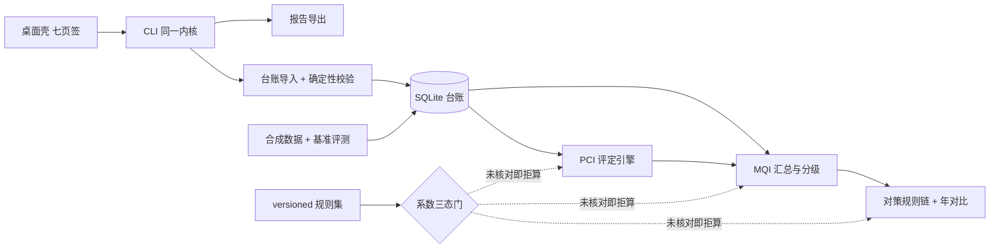

# road-mqi-checker

公路技术状况评定与养护决策支持工具 —— 全离线、规则优先、逐格系数挂条款号、结果可复算。

它管的是一条路**每年的检测账**：扣分表内置、路段台账持久、MQI 与分项指标可复算、
评分变化能追到具体破损项。聊天框答不出"这段 4.2 公里今年比去年低 6 分是哪几处坑槽扣掉的、
按规则该排小修还是中修"——因为它没有路段台账，也没有可复算的扣分表。

> **状态：M2 评定内核（✅）／M3 规则与条款（✅，查证结论为"官方原文不可得"）／M4 汇总、对策与年对比（✅）／M5 基准与评测（✅）／M6 交付层（🟡 报告导出与桌面壳已转真并实测；发布面 CI 首跑 / tag / release 待授权）** ——
> 台账导入、导入回执、八类确定性校验、合成数据基准、**路面 PCI 评定与扣分贡献展开**、
> **三级 MQI 汇总与分级判定、对策规则链与优先序、年对比与变化贡献项**、
> **两通路四态基准评测（`rmqc bench run`）**、**报告导出（`rmqc report`：csv / md / docx 三格式）**与
> **桌面壳（`rmqc gui`：七页签只转发同一个 CLI 内核，`--probe` 为存活探针）**均已实跑；
> 演示数据（3 条虚拟路线 × 4 个年度）作为冻结 fixtures 入仓，同 seed 重跑逐字节一致。
> 规范来源 14 格系数仍未解锁，
> 交付面**评定 / 汇总 / 对策三条路径都不出数**（这是设计，不是缺陷，见下）——
> 真值文件的评分四列同样只出 `pending` 令牌，因此基准评测在内置包通路上**如实报不可判**；
> 因此导出的报告与清单里，数值列与等级列一律留空并逐格写明拒算原因：
> **"这张表能导成 docx"不等于"可交付的评定结果"**，导出层做的只是把引擎的账原样落到文件上。

## 为什么现在算不出分

评定依据是《公路技术状况评定标准》JTG 5210-2018。扣分比率、分项权重、分级阈值的**每一格数字**
都要按原文核对并登记条款号与查证渠道才允许进入计算；未核对的格子一律 `pending`，
对应结果输出 `blocked` 且数值字段全空。

内置规则集 `src/road_mqi_checker/rulesets/base-jtg5210-2018.json` 声明了评定路径需要的 15 格系数，
当前 1 格生效、14 格待核对：**生效的那一格是不依赖规范原文的用户自定闭合差容差**（±1 m，
理由与改法见 `data/README.md` §一 第 9 行、`plan/04` §三），规范来源的 14 格一格都没生效。
M3 轮换了官方渠道逐条复核，仍然取不到能定位条款号与表号的原文电子版 —— 官方页只有公告（公告里没有数值表），
标准平台的正文靠脚本渲染、出版社与主编单位站点连不上，全文命中处全是文档分享站，一律不采信。
逐渠道的 URL / HTTP 码 / 字节数 / sha1 留在 `.tmp_verify/M3/`，映射表写在 `plan/04`。
这不是保守，而是这道题的立身之处：**凭记忆填的扣分表一定是错的**，
一个会静默给出错误评分的养管工具比没有工具更糟。

评定内核本身已经在跑：换算式、分项合成、舍入、拒算条件写在 `plan/05-评定与汇总算法说明.md`，
数值通路由 `tests/fixtures/` 里两套"已核对形态"的夹具规则集验证（夹具数刻意避开任何真实规范数字，
红线测试保证它不进 `data/`、不进内置包）。所以"算得对"与"数字可信"是两条独立的证据链，
各自有测试，不互相顶替。

## 特性（已锁定的行为）

- **系数三态**：`pending / located / verified`（+ 仅测试可用的 `fixture`）；只有已核对的格子能驱动数值，
  生效档位取"系数自身状态与各依据条款状态的最弱一档"；
- **拒算契约**：`blocked` / `uncomparable` 的结果对象数值字段必须全空，不是 0、不是 NaN；
  `partial` 必须带口径声明（分项不全时不冒充完整 MQI）；
- **可追溯**：扣分贡献项结构上强制挂"系数 key + 条款号"，评分变化能拆到破损类型×程度；
- **PCI 评定内核**（M2）：沥青与水泥两套"破损 → 扣分比率 → 分项得分 → 合成 PCI"纯算术换算，
  每一项比率/权重/边界都从规则集取，缺任一格必需系数即 `blocked`；分项缺测转 `partial` 并声明口径，
  不把缺测当 0；分级边界的含界与否由规则集登记，引擎不猜；
- **扣分贡献展开**（M2）：逐条"哪条破损哪个程度扣了多少"，`Σ 贡献 = 满分 − PCI`，
  并按台账行号回指原始检测表的具体行；排序有固定次级键，重排输入逐行一致；
- **含异常数据即拒算**（M2）：台账里被校验层判为负值/超范围/量纲错/重复导入的对象，
  评定出 `blocked` + 数值字段全空，而不是"跳过那条破损行后算出的一个数"；
- **MQI 三级汇总**（M4）：路段→路线→路网共用同一套权重格与同一个分母（纳入汇总的路段长度和），
  "先路线后路网"与"直接对全部路段"逐位相等；`blocked` 成员连同其里程一起退出分子与分母并逐一点名，
  不按 0 计也不按比例摊分；分项不全时值为 `partial` + 口径声明，**且不给等级**（部分口径不套用
  完整 MQI 的分级表述），权重与阈值同样只能来自规则集；
- **对策规则链与优先序**（M4）：IF（指标 + 比较符 + 阈值）→ THEN（工程类别 + 规模档），
  按规则集登记顺序首条命中即定案，每条结论挂该格的条款号；系数未核对 / 指标未出数 / 条件均未触发
  三种拒算各有各的原因文本，未触发不写成 ok；同分排序用固定次级键（`route_id → start_stake_m → segment_id`），
  未出数的对象在升序与降序下都排最后；
- **年对比与变化贡献**（M4）：差值、劣化速率（正值 = 每年劣化多少分）、跨年划分不可比判定
  （消费 `partition_change`，不可比**不出变化率**）、变化拆到"哪类哪程度的破损/哪个实测指标扣分明细变了"；
- **两通路四态基准评测**（M5）：8 条指标 × 内置包 / 夹具包 = 16 行，每行显式报**分子 / 分母 / 状态**
  （`rmqc bench run --json`）；内置包不消费未核对系数 ⇒ 数值类指标一律"不可判（分母为 0）"，
  夹具包出数并可复算（复算误差 0、重排 214 / 变化 231 / 三级 32 次比对逐位相符）；
  已声明的不可判名单写在代码常量 `DECLARED_INDETERMINATE` 里，门禁只红于
  "未达标 / 不可用 / 名单外新不可判"，**不把不可判挤成达标**；
- **确定性**：自研 splitmix64 随机源 + 固定舍入（半值向上）+ 固定次级键排序；同数据同规则集重跑结果一致；
- **台账持久**：SQLite 单文件（路线→路段→年度检测→破损行 + 导入回执 + 划分变更），异常值可入库并被检出；
- **导入回执**：入库/拒入行数与逐条拒因（文件、行号、字段、拒因代码），`--dry-run` 只预检不写库，
  同一份文件按来源摘要去重（重复导入也留回执，不静默）；
- **八类确定性校验**：桩号悬空/重叠、长度闭合差、破损字典、量纲一致、负值与超范围、重复导入、
  跨年划分变更；依赖未核对系数的判据只出"待核对，未判定"，不硬判；
- **合成数据基准**：3 条虚拟路线 × 4 个年度，八类注入缺陷 19 例，真值与数据同源；
  同 seed 两次运行逐字节一致（含 EOL），演示数据作为冻结 fixtures 入仓；
- **数据类别闸门**：演示文件带 `data_class=SYNTHETIC` 标记并强制白名单，真实台账用 `--data-class user` 显式声明；
- **跨年度划分不可比要显式标记**，不静默按比例摊分；
- **报告导出**（M6）：`--scope assessment` 出台账概况 + 路段 PCI 评定表 + MQI 汇总与分级表，
  `--scope plan` 出 `PLAN_COLUMNS` 16 列的优先序清单，两者都以固定免责声明收尾（声明必在末尾）；
  字段一律转述各引擎已有的 `result_payload()`，导出层不重算、不重排、不二次舍入，
  blocked/uncomparable 行原样留在表里、数值列留空（不是 0、不是 `None` 字样）；
  docx 由标准库直写 OOXML（三个部件、zip 条目时间固定 1980-01-01 00:00:00），
  所以三种格式两次导出都逐字节一致；
- **导出层自带闸门**（M6）：`exporters.assert_export_safe` 在导出通路上再拦一次——过强措辞、
  夹具（fixture）字样、绝对路径 / 本机用户名 / 时间戳形态一律拒入，不假定上游命令面已经干净；
- **桌面壳只转发**（M6）：七页签每页的"运行内核"调的都是 `cli.main(argv)`，退出码与输出文本
  与命令行逐字一致；页签→命令映射由 `PAGE_TITLES` / `PAGE_COMMANDS` / `PAGE_SPECS` 声明，
  测试断言"每个页面要发的 flag 都必须存在于 CLI parser 里"（GUI 不发明参数）；
  `rmqc gui --probe` 可在无显示环境跑存活探针；
- **全离线**：不联网、不调用任何大模型；CI 与测试用断网探针验证这一点；
- **数据红线**：演示数据全部程序合成，路线编号/行政代码/手机号/DOI 走白名单校验，真实形态一律拒绝入库；
- **同一内核三种入口**：CLI（`rmqc`）/ `python -m road_mqi_checker` / 桌面壳（`rmqc gui`，M6 已转真）。

## 架构



## 快速开始

源码态（需要 Python 3.8+，核心零第三方依赖）：

```bash
py -m venv .venv
.venv\Scripts\activate            # Windows；Linux/macOS 用 source .venv/bin/activate
python -m pip install -U pip setuptools wheel    # 3.8 自带 pip 装不了 pyproject-only 项目
python -m pip install -e .[dev]

rmqc version
rmqc selfcheck                    # 内核自检：数据目录 / 规则集 / 系数门 / 台账 schema
rmqc ruleset list                 # 查看规则集包与生效系数格数
rmqc ruleset show                 # 逐格系数：状态、口径、依据台账行号
rmqc ledger tables                # 查看 SQLite 台账表结构

rmqc bench generate --seed 20261007   # 重生成演示数据：内容一致时逐字节不动；要改动入仓产物需显式 --force
rmqc --db ledger.sqlite ledger init   # 建台账库
rmqc --db ledger.sqlite import --file data/raw/S99-2022.csv --year 2022 --dry-run   # 只预检
rmqc --db ledger.sqlite import --file data/raw/S99-2022.csv --year 2022              # 入库 + 回执 + 八类校验
rmqc --db ledger.sqlite assess --year 2022                    # 逐路段 PCI 评定（系数未核对 → 全部 blocked，落 1）
rmqc --db ledger.sqlite assess --year 2022 --segment S99-A1   # 只评一个路段
rmqc --db ledger.sqlite --json assess --year 2022             # 结构化的评定结果 + 扣分贡献清单
rmqc --db ledger.sqlite aggregate --year 2022 --level route    # 三级 MQI 汇总与对策优先序
rmqc --db ledger.sqlite compare --from-year 2022 --to-year 2023  # 年对比与变化贡献项（不可比不出变化率）
rmqc bench run                                  # 基准评测：两通路 × 8 指标，逐行报分子/分母/状态
rmqc --json bench run                            # 同一份数据的结构化输出（下方评测表由它生成）
rmqc --db ledger.sqlite report --year 2022 --format md --out report.md   # 导出评定报告（内置包下数值列留空，落 1）
rmqc --db ledger.sqlite report --year 2022 --scope plan --out plan.csv   # 优先序清单（不给 --from-year 时 delta 两列留空）
rmqc gui --probe                                 # 桌面壳存活探针：建七页签、逐页转发内核后退出（需 [gui] extras）
python -m pytest                  # 守门测试
```

免安装 exe（tag `m6` 的 release 资产）：<https://github.com/yuluo554/road-mqi-checker/releases/tag/m6>

- `rmqc-cli-win64.zip`（12.3 MB，47 个文件）：`rmqc.exe` 控制台壳，解压后双击或在中立目录跑；
- `rmqc-gui-win64.zip`（48.2 MB，194 个文件）：同包内含 `rmqc.exe` 与 `rmqc-gui.exe`（窗口壳）。

两者都由 `packaging/rmqc.spec` 一次构建产出（onedir，共用一份 `_internal`）。
`rmqc-gui.exe` 不带 `--probe` 会进 Qt 事件循环等用户关窗，已实测的是 `--probe` 形态。
已实测的部分：把整包拷到仓库外的中立目录后，控制台 exe 跑通
`selfcheck` / `ruleset list` / `ledger init` / `import` / `assess` / `aggregate` / `compare` /
`report --format csv|md|docx`（内置系数包下按既有口径落 1），GUI exe 的 `--probe` 落 0；
构建后红线断言（内嵌数据与仓库逐份 sha256 对账、无夹具字样、无真实形态标识符、无标准全文）全过。
`bench run` 在打包态按设计落 **3**：包里没有 `tests/fixtures/`，夹具通路如实报"不可用"——
这是"夹具值不进交付面"这条红线的后果，不是回归（见 `plan/07` §3.4）。
**未实测的部分**：桌面壳的窗口交互（鼠标点选文件、拖窗、真实显示器上的观感）只到探针层级，
需要人工在桌面环境过一遍；发布包（zip 资产）尚未上传到任何渠道。

### 命令与退出码

| 码 | 含义 |
|---|---|
| 0 | 完成 |
| 1 | 降级完成（存在 blocked/uncomparable/partial 项） |
| 2 | 输入不可用（未进入评定路径） |
| 3 | 尚未实现（属未来里程碑） |

`report` 自 M6 起真跑：`--year` 与 `--out` 必填，`--format csv|md|docx` 默认 csv 且 `--out` 的后缀
要与格式一致（不一致即拒），`--scope assessment|plan` 默认 assessment，`--level segment|route|network`
默认 route（作用于汇总表），`--from-year` 可选——给了才从年对比结果转述 `delta` 与
`deterioration_rate_per_year` 两列，不给就留空，不做推测性摊分。导出成功但存在 blocked/partial/uncomparable
对象时落 1（内置系数包下就是这样）；该年度台账无路段行、导出目录不存在、后缀与格式不符都落 2；
它已经不走 3 号那一档。`gui` 自 M6 起真跑：装了 `[gui]` extras 时 `gui --probe` 落 0，
缺 PySide6 落 1 并给 `pip install road-mqi-checker[gui]` 提示。
命令面上已没有任何命令走占位符通路（`MilestoneNotImplemented` → 3 号的映射机制保留给未来骨架，
占位符登记表 `_meta.PLACEHOLDER_MILESTONES` 现为空、`_meta.MILESTONE` = `M6`；
打包态 `bench run` 落 3 是"通路不可用"那一档 —— 包里没有 `tests/fixtures/`，与占位符无关，见上文的免安装 exe 段）；
`import`、`bench generate` 自 M1 起真跑（`import` 有拒入行时落 1），`assess` 自 M2 起真跑，
`aggregate`、`compare` 自 M4 起真跑（存在 blocked/partial/uncomparable 项时落 1；
对应年度台账没有路段行时落 2），`bench run` 自 M5 起真跑，退出码按指标四态映射：
只出达标与"已声明的不可判"→ 0，存在未达标 → 1，出现名单外的新不可判 → 2，通路不可用 → 3。

## 评测（四态如实，不写假绿）

指标状态分四态：达标 / 未达标 / 不可判（分母为 0）/ 不可用（通路拿不到）。

<!-- bench-run:begin -->
| 指标 | 目标 | 当前 | 说明 |
|---|---|---|---|
| 评分复算误差 | = 0 | 内置包（交付面） 不可判（分母为 0） ／ 夹具包（数值通路） 达标 0.0 | 内置包（交付面）：分子 0 / 分母 0，最大复算误差 不可判（本通路无出数格可比）；真值令牌与台账拒算相符 168/168 格（拒算对象不混进误差分母，也没被摘掉） 夹具包（数值通路）：分子 144 / 分母 144，最大复算误差 0.0；真值令牌与台账拒算相符 24/24 格（拒算对象不混进误差分母，也没被摘掉） |
| 等级判定准确率 | >= 0.95 | 内置包（交付面） 不可判（分母为 0） ／ 夹具包（数值通路） 不可判（分母为 0） | 内置包（交付面）：分子 0 / 分母 0，独立规范等级真值 0 份（分级阈值原文不可得，夹具档等级是虚构数）；本通路出数值 0 个、出等级 0 个，其等级由同一内核算出，只能自证一致、不能自证正确 ⇒ 分母为 0。 夹具包（数值通路）：分子 0 / 分母 0，独立规范等级真值 0 份（分级阈值原文不可得，夹具档等级是虚构数）；本通路出数值 36 个、出等级 36 个，其等级由同一内核算出，只能自证一致、不能自证正确 ⇒ 分母为 0。 |
| 扣分贡献项排序一致性 | >= 0.95 | 内置包（交付面） 不可判（分母为 0） ／ 夹具包（数值通路） 达标 1.00 | 内置包（交付面）：分子 0 / 分母 0，贡献项 ≥2 的对象 0 个；展开视图逐行带系数 key、条款号与台账行号，重排输入后逐行一致 ⇒ 排序不依赖迭代顺序。 夹具包（数值通路）：分子 214 / 分母 214，贡献项 ≥2 的对象 36 个；展开视图逐行带系数 key、条款号与台账行号，重排输入后逐行一致 ⇒ 排序不依赖迭代顺序。 |
| MQI 汇总口径一致性 | 三级同一分母可互相复算 | 内置包（交付面） 不可判（分母为 0） ／ 夹具包（数值通路） 达标 1.00 | 内置包（交付面）：分子 0 / 分母 0，由路段级结果 + 台账里程独立复算三级汇总；无一出数的汇总对象 16 个不参与复算（其拒算理由由 aggregate 通路逐格点名）。 夹具包（数值通路）：分子 32 / 分母 32，由路段级结果 + 台账里程独立复算三级汇总；无一出数的汇总对象 0 个不参与复算（其拒算理由由 aggregate 通路逐格点名）。 |
| 变化贡献项排序一致性 | >= 0.95 | 内置包（交付面） 不可判（分母为 0） ／ 夹具包（数值通路） 达标 1.00 | 内置包（交付面）：分子 0 / 分母 0，有变化贡献可拆的对次 0 个；uncomparable 对次不出变化拆解，因此也不进本项分母（原因代码由 compare 通路报出）。 夹具包（数值通路）：分子 231 / 分母 231，有变化贡献可拆的对次 19 个；uncomparable 对次不出变化拆解，因此也不进本项分母（原因代码由 compare 通路报出）。 |
| 数据异常识别召回 | >= 0.95 | 内置包（交付面） 达标 1.00 ／ 夹具包（数值通路） 达标 1.00 | 内置包（交付面）：分子 19 / 分母 19，期望 19 例（格级 12 + 划分变更标记 7），命中格级 12（其中 2 例的证据是导入回执 R008）、划分变更 7；划分变更另有 5 条检出是生成器 INJECTION_IMPLICATIONS 声明过的隐含结论（父侧与子侧同报），既不算漏报也不另计进分母。 夹具包（数值通路）：分子 19 / 分母 19，期望 19 例（格级 12 + 划分变更标记 7），命中格级 12（其中 2 例的证据是导入回执 R008）、划分变更 7；划分变更另有 5 条检出是生成器 INJECTION_IMPLICATIONS 声明过的隐含结论（父侧与子侧同报），既不算漏报也不另计进分母。 |
| 数据异常识别误报 | = 0 | 内置包（交付面） 达标 0.00 ／ 夹具包（数值通路） 达标 0.00 | 内置包（交付面）：分子 0 / 分母 30，干净对象 30 个（总 42 减格级标记 12）上的格级六类检出 0 处；划分变更标记对象留在分母里（它们本就不该有格级检出），其划分检出另按生成器声明计，不重复计入本项。 夹具包（数值通路）：分子 0 / 分母 30，干净对象 30 个（总 42 减格级标记 12）上的格级六类检出 0 处；划分变更标记对象留在分母里（它们本就不该有格级检出），其划分检出另按生成器声明计，不重复计入本项。 |
| 产物位级一致 | 两次运行逐字节一致 | 内置包（交付面） 达标 ／ 夹具包（数值通路） 达标 | 内置包（交付面）：分子 25 / 分母 25，同 seed 重生成与入仓演示数据逐份比对（raw + truth + manifest，含 EOL 与时间戳形态）。 夹具包（数值通路）：分子 25 / 分母 25，夹具包真值列出数，与入仓数据（pending 令牌）本就不同 ⇒ 比对同一规则集的两次重生成。 |
<!-- bench-run:end -->

M2 新增的纪律类证据：内置规则集下 `assess` 对 4 个路段逐个 `blocked`（退出码 1、数值字段全空、
拒算原因逐格点名六格必需系数）；M1 注入的负值/超范围/单位错共 6 个对象，评定通路逐个 `blocked`
且原因里引用校验层类别，不是"跳过破损行后算出的一个数"；8 个水泥对象因不测车辙而转 `partial` 并带口径声明。
M3 新增的纪律类证据：`rmqc selfcheck` 显示"生效系数 1 格 → 系数门开"，但**门开不等于能出数** ——
`assess` 对 4 个路段仍逐个 `blocked`（六格必需系数一格都没生效），`bench generate` 的说明行与
`manifest.json` 的 `truth_note` 都按"必需格是否全部生效"如实说"评分列仍为 pending 令牌"；
闭合差则从"待核对，未判定"变成真的判：4 个非零闭合差（−200 / +100 m）全部转为检出 `R004_CLOSURE_EXCEEDED`，
另有测试把容差格退回 pending 的临时包，证明"未判定"是系数门挡的而不是没实现。
M1 能实测的还包括：`rmqc selfcheck` 的台账 schema 与 GUI 页签自检；
489 项守门测试断言三态、拒算、离线、隐私、CI、EOL、位级一致、换算黄金用例、系数逐格二选一、
生效格 values 形状契约、官方渠道判据、三级同分母、部分口径不给等级、不可比拒出变化率、
两通路四态与门禁只红于三类、README 评测表与命令输出逐行对账、
导出层的三类污染拒入与三格式逐字节一致、GUI 页签参数必须能在 CLI parser 里找到、
闸门自身环境稳健性等口径不被破坏
（Python 3.8.8 与 3.12.10 双通道实测：各收集 489 项、各 489 通过、0 跳过、0 警告。
M6 这一轮的净增 77 项构成：新增 `tests/test_m6_report.py` 51 项 + 新增 `tests/test_m6_gui.py` 23 项 +
`tests/test_cli_contract.py` 的占位符命令门由 3 条换成 4 条并新增冻结态落点门（净 +2）+
`tests/test_placeholder_registry.py` 的 M6 转真门（+1））。
本表由 `rmqc bench run --json` 生成（`bench-run:begin/end` 标记之间），
`test_readme_metric_table_is_generated_from_bench_run` 逐行对账，手改表格会打挂测试。

M4 新增的纪律类证据：`rmqc selfcheck` 现在按**路径**说出数判据
（"assess 缺 8 格不出数 / aggregate 缺 2 格不出数 / actions 缺 1 格不出数（生效格数不等于可出数）"）；
内置包下 `aggregate` 三级全部 `blocked`（`--json` 里 `mqi`/`grade`/`weighted_length_m` 全 null）、
`compare` 的 36 个对次全部不出变化率；夹具包下路段级 42 对象 = partial 36 / blocked 6，
**ok 为 0**——因为首期只有路面分项，出数的对象一律带口径声明点名"路基/桥隧/沿线设施未纳入"，
且等级字段一律不给（部分口径不套用完整 MQI 的分级表述）；
年对比在 M1 注入的划分变更上有 9 个对象判 `uncomparable` 并给出原因代码，
没有一个被"按重叠里程摊分"成变化率。

M5 新增的纪律类证据（`rmqc bench run` 的命令输出，不是手抄）：**同一张指标表按两条通路各报一组数**——
内置包通路上 4 项数值类指标全部"不可判（分母为 0）"，因为 42 个对象的 168 个真值格全是 pending 令牌、
台账通路也全部拒算（可判的是不消费系数的三项：召回 19/19、误报 0/30、位级一致 25/25）；
夹具包通路上复算误差 0（144/144 格逐字段相符）、扣分贡献重排 214 次、变化贡献重排 231 次、
三级汇总复算 32 次全部逐位相符。"等级判定准确率"在**两条通路都写不可判**：
判定通路已交付、夹具包下 36 个对象出等级，但等级由同一内核算出，没有独立的规范真值可比，
分母为 0 —— 这一项写在 `DECLARED_INDETERMINATE` 里，门禁对它不红，也不许改成"达标 1.00"。
M4 的 `.tmp_verify/M4/measure.log` 里那些手写实测数，现在由命令自己报出来。

M6 新增的纪律类证据（导出与桌面壳，都是实跑命令 `rmqc report` / `rmqc gui --probe` 的形态）：
导出物一律经 `disclaimer.compose_document` 拼装，所以"固定免责声明两行必在末尾"是结构事实而不是文案；
内置系数包下 `report` 落 1 —— 表里 blocked/uncomparable 行原样保留、数值列与等级列留空
（不是 0、不是 `None` 字样）、拒算原因随行给出；`--scope plan` 未给 `--from-year` 时
`delta` 与 `deterioration_rate_per_year` 两列同样留空，不摊分；
三类污染在导出层逐个拒入（过强措辞四词"已确认/已核实/最终确定/必定"按每种格式各测一遍、
夹具 `fixture` 字样、绝对路径 / 本机用户名 / 时间戳形态）；
三种格式两次导出逐字节一致（docx 走标准库直写 OOXML，三个部件、zip 条目时间固定 1980-01-01 00:00:00）；
字段全部转述 `pci.engine` / `mqi.engine` / `strategy.rules` / `strategy.compare` 的 `result_payload()`，
导出层不重算、不重排、不二次舍入（`84.05` 不会被排成 `84.1`）。
桌面壳七页签（台账与导入 / 路面 PCI 评定 / MQI 汇总与等级 / 年对比与优先序 / 基准评测 /
依据登记与规则集 / 导出与声明）**只转发**：每页"运行内核"走 `cli.main(argv)`，
退出码与输出文本与命令行逐字一致（内置包下 blocked 的 `assess` 在页面上显示 1，不改判成成功）；
页面要发的每个 flag 都有门断言"存在于 CLI parser 里"，GUI 不许发明参数；
`gui --probe` 是双向断言——装了 PySide6 返回 0（建主窗口、数七页签、跑一次 `version` 转发、
再逐页触发内核，不进事件循环），缺 PySide6 返回 1 并给 `pip install road-mqi-checker[gui]` 提示。
这一轮**没有**改变交付面不出数这件事：导出的是一张数值列留空、逐格写明拒算原因的表，
不是可交付的评定结果；基准评测在内置包通路上仍如实报"不可判（分母为 0）"。
打包与发布面的实测与待办以 `plan/07-交付与打包.md`、`plan/RELEASE-M6.md` 的回执为准 ——
建仓 / push / CI 四矩阵首跑 / tag / release 资产都还在等授权。

## 目录

```
plan/            开发全过程文档（题目定稿、计划、数据字典、条款映射、算法、基准、交付、交接快照）
data/            合成检测数据、真值标注、黄金用例、条款摘录笔记（不含标准全文）
  README.md      依据查证记录（逐条挂渠道与状态）+ 合成数据白名单
src/road_mqi_checker/
  ruleset/       系数三态与规则集 schema/选取（口径层）
  ledger/        台账模型与 SQLite 结构、导入与确定性校验（模块 1）
  pci/           路面 PCI 评定与扣分展开（模块 2）
  mqi/           MQI 三级加权与分级（模块 3）
  strategy/      对策规则链、优先序、年对比（模块 4）
  bench/         合成数据生成器与基准评测（模块 5）
  report/        导出与固定免责声明（交付）
  gui/           PySide6 桌面壳（交付，可选依赖）
  cli.py         同一内核的命令行入口
  privacy.py     合成数据白名单校验（隐私红线）
  data_paths.py  数据目录查找（含 exe 冻结分支）
  results.py     结果对象与拒算契约
tests/           守门测试与夹具（夹具值只在 tests/fixtures）
.github/         CI（ubuntu/windows × Python 3.8/3.12 四矩阵）
```

## 限制与非目标

- 首期只做**路面 PCI（沥青 + 水泥混凝土）+ MQI 部分口径汇总 + 年对比**；
  路基、桥梁隧道、沿线设施分项以"未评定"参与汇总口径声明，不做其专项评定；
- 不做路面结构强度与弯沉评定、不做工程量计算与定额计价、不做病害图像识别、不做 GIS 大屏；
- 不做检测车原始信号处理；
- 分项不全时只输出注明口径的部分指标值，不输出"完整 MQI 评定值"；
- 跨年度路段划分不可比时不输出变化率与劣化速率结论。

## 免责声明

本工具输出的是"按已核对规则算出的评定值与规则链建议"，属**辅助定位**：
不替代养护科学决策，不替代正式评定报告，不用于设计、造价与验收。
标注为待核对（`pending` / `located`）的系数一律未参与计算，相应结果只给出拒算原因与"应核实"提示。

仓库内的演示与评测数据均为程序合成的虚构数据（`SYNTHETIC`）：路线编号、行政区划代码、桩号、
单位与人员信息全部虚构，不代表任何真实路线。本仓库不收录标准全文或扫描件，只放自行整理的条款摘录笔记。

## 已知环境问题

- Windows 控制台默认 GBK 代码页，跑脚本建议 `python -X utf8`；
- 本机 `core.autocrlf=true`：仓库已用 `.gitattributes` 强制 LF，并有 CR 守门测试；
- Python 3.8 自带的旧 pip 无法可编辑安装 pyproject-only 项目，务必先执行 `pip install -U pip setuptools wheel`；
- Windows 的 `py` 启动器会绕过 venv，激活后请用 `python -m pip`；
- 冻结 exe 的验证要在中立目录（如 `%LOCALAPPDATA%\Temp`）下进行，在仓库树内跑会命中仓库 `data/` 而验不到内嵌数据。

## 许可

MIT（见 `LICENSE`）。开发过程文档见 `plan/00-README总览.md`。
