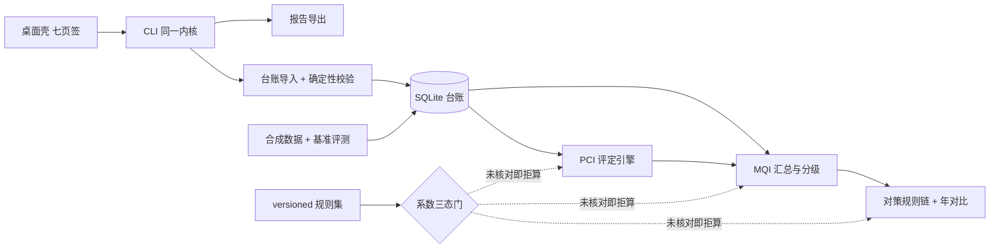

# road-mqi-checker

公路技术状况评定与养护决策支持工具 —— 全离线、规则优先、逐格系数挂条款号、结果可复算。

它管的是一条路**每年的检测账**：扣分表内置、路段台账持久、MQI 与分项指标可复算、
评分变化能追到具体破损项。聊天框答不出"这段 4.2 公里今年比去年低 6 分是哪几处坑槽扣掉的、
按规则该排小修还是中修"——因为它没有路段台账，也没有可复算的扣分表。

> **状态：M2 评定内核（🚧 准备中）** —— 台账导入、导入回执、八类确定性校验、合成数据基准，
> 以及**路面 PCI 评定与扣分贡献展开**已可实跑（`rmqc assess --year …`）；
> 演示数据（3 条虚拟路线 × 4 个年度）作为冻结 fixtures 入仓，同 seed 重跑逐字节一致。
> MQI 汇总/年对比/对策清单/报告导出/桌面壳按计划分别在 M4–M6 落地。当前所有系数为"待核对"，
> 交付面评定路径**不出数**（这是设计，不是缺陷，见下）—— 真值文件的评分四列同样只出 `pending` 令牌。

## 为什么现在算不出分

评定依据是《公路技术状况评定标准》JTG 5210-2018。扣分比率、分项权重、分级阈值的**每一格数字**
都要按原文核对并登记条款号与查证渠道才允许进入计算；未核对的格子一律 `pending`，
对应结果输出 `blocked` 且数值字段全空。

内置规则集 `src/road_mqi_checker/rulesets/base-jtg5210-2018.json` 声明了评定路径需要的 15 格系数，
当前 0 格生效。这不是保守，而是这道题的立身之处：**凭记忆填的扣分表一定是错的**，
一个会静默给出错误评分的养管工具比没有工具更糟。

评定内核本身已经在跑：换算式、分项合成、舍入、拒算条件写在 `plan/05-评定与汇总算法说明.md`，
数值通路由 `tests/fixtures/` 里两套"已核对形态"的夹具规则集验证（夹具数刻意避开任何真实规范数字，
红线测试保证它不进 `data/`、不进内置包）。所以"算得对"与"数字可信"是两条独立的证据链，
各自有测试，不互相顶替。

## 特性（已锁定的行为）

- **系数三态**：`pending / located / verified`（+ 仅测试可用的 `fixture`）；只有已核对的格子能驱动数值，
  生效档位取"系数自身状态与各依据条款状态的最弱一档"；
- **拒算契约**：`blocked` / `uncomparable` 的结果对象数值字段必须全空，不是 0、不是 NaN；
  `partial` 必须带口径声明（分项不全时不冒充完整 MQI）；
- **可追溯**：扣分贡献项结构上强制挂"系数 key + 条款号"，评分变化能拆到破损类型×程度；
- **PCI 评定内核**（M2）：沥青与水泥两套"破损 → 扣分比率 → 分项得分 → 合成 PCI"纯算术换算，
  每一项比率/权重/边界都从规则集取，缺任一格必需系数即 `blocked`；分项缺测转 `partial` 并声明口径，
  不把缺测当 0；分级边界的含界与否由规则集登记，引擎不猜；
- **扣分贡献展开**（M2）：逐条"哪条破损哪个程度扣了多少"，`Σ 贡献 = 满分 − PCI`，
  并按台账行号回指原始检测表的具体行；排序有固定次级键，重排输入逐行一致；
- **含异常数据即拒算**（M2）：台账里被校验层判为负值/超范围/量纲错/重复导入的对象，
  评定出 `blocked` + 数值字段全空，而不是"跳过那条破损行后算出的一个数"；
- **确定性**：自研 splitmix64 随机源 + 固定舍入（半值向上）+ 固定次级键排序；同数据同规则集重跑结果一致；
- **台账持久**：SQLite 单文件（路线→路段→年度检测→破损行 + 导入回执 + 划分变更），异常值可入库并被检出；
- **导入回执**：入库/拒入行数与逐条拒因（文件、行号、字段、拒因代码），`--dry-run` 只预检不写库，
  同一份文件按来源摘要去重（重复导入也留回执，不静默）；
- **八类确定性校验**：桩号悬空/重叠、长度闭合差、破损字典、量纲一致、负值与超范围、重复导入、
  跨年划分变更；依赖未核对系数的判据只出"待核对，未判定"，不硬判；
- **合成数据基准**：3 条虚拟路线 × 4 个年度，八类注入缺陷 19 例，真值与数据同源；
  同 seed 两次运行逐字节一致（含 EOL），演示数据作为冻结 fixtures 入仓；
- **数据类别闸门**：演示文件带 `data_class=SYNTHETIC` 标记并强制白名单，真实台账用 `--data-class user` 显式声明；
- **跨年度划分不可比要显式标记**，不静默按比例摊分；
- **全离线**：不联网、不调用任何大模型；CI 与测试用断网探针验证这一点；
- **数据红线**：演示数据全部程序合成，路线编号/行政代码/手机号/DOI 走白名单校验，真实形态一律拒绝入库；
- **同一内核三种入口**：CLI（`rmqc`）/ `python -m road_mqi_checker` / 桌面壳（M6）。

## 架构



## 快速开始

源码态（需要 Python 3.8+，核心零第三方依赖）：

```bash
py -m venv .venv
.venv\Scripts\activate            # Windows；Linux/macOS 用 source .venv/bin/activate
python -m pip install -U pip setuptools wheel    # 3.8 自带 pip 装不了 pyproject-only 项目
python -m pip install -e .[dev]

rmqc version
rmqc selfcheck                    # 内核自检：数据目录 / 规则集 / 系数门 / 台账 schema
rmqc ruleset list                 # 查看规则集包与生效系数格数
rmqc ruleset show                 # 逐格系数：状态、口径、依据台账行号
rmqc ledger tables                # 查看 SQLite 台账表结构

rmqc bench generate --seed 20261007   # 重生成演示数据：内容一致时逐字节不动；要改动入仓产物需显式 --force
rmqc --db ledger.sqlite ledger init   # 建台账库
rmqc --db ledger.sqlite import --file data/raw/S99-2022.csv --year 2022 --dry-run   # 只预检
rmqc --db ledger.sqlite import --file data/raw/S99-2022.csv --year 2022              # 入库 + 回执 + 八类校验
rmqc --db ledger.sqlite assess --year 2022                    # 逐路段 PCI 评定（系数未核对 → 全部 blocked，落 1）
rmqc --db ledger.sqlite assess --year 2022 --segment S99-A1   # 只评一个路段
rmqc --db ledger.sqlite --json assess --year 2022             # 结构化的评定结果 + 扣分贡献清单
python -m pytest                  # 守门测试
```

免安装 exe（M6 之后提供）：双击 `road-mqi-checker.exe`，或在中立目录用同包的控制台 exe 跑
`rmqc.exe selfcheck` / `rmqc.exe bench run`。

### 命令与退出码

| 码 | 含义 |
|---|---|
| 0 | 完成 |
| 1 | 降级完成（存在 blocked/uncomparable/partial 项） |
| 2 | 输入不可用（未进入评定路径） |
| 3 | 尚未实现（属未来里程碑） |

`aggregate / compare / bench run / report / gui` 当前返回 3 并指明所属里程碑；
`import`、`bench generate` 自 M1 起真跑（`import` 有拒入行时落 1），`assess` 自 M2 起真跑
（存在 blocked/partial 项时落 1；该年度台账没有路段行时落 2）。

## 评测（四态如实，不写假绿）

指标状态分四态：达标 / 未达标 / 不可判（分母为 0）/ 不可用（通路拿不到）。

| 指标 | 目标 | 当前 | 说明 |
|---|---|---|---|
| 评分复算误差 | = 0 | **达标 0** | 42 个"路段×年度"对象在夹具规则集通路上，真值列与台账通路逐字段比对 0 处不符；另有两次进程冷启动 `assess --json` 输出逐字节一致。系数未核对的内置包一律不出数，所以这一项目前只能在夹具通路实测（M5 起并入 `bench run`） |
| 等级判定准确率 | ≥ 0.95 | 不可用 | 分级阈值待核对（M3）+ 判定属 M4 |
| 扣分贡献项排序一致性 | ≥ 0.95 | **达标 1.00** | 逐位旋转 + 反序输入后重新展开，214 次比较全部与参考序列逐行相同（`test_m2_trace.py`） |
| 数据异常识别召回 | ≥ 0.95 | **达标 1.00** | 八类注入 19 例全检出：格级 12/12（2 例证据是导入回执 `R008`，10 例是校验 finding）+ 划分变更 7/7 |
| 数据异常识别误报 | = 0 | **达标 0.00** | 未被格级注入标记的 32 个"路段×年度"对象上，格级六类零检出；另有 6 条检出是声明过的隐含结论，不算误报 |
| 产物位级一致 | 两次运行逐字节一致 | **达标** | 同 seed 重生成与入仓数据逐份 sha1 相同；`--force` 重跑 `git status` 零变化 |

M2 新增的纪律类证据：内置规则集下 `assess` 对 4 个路段逐个 `blocked`（退出码 1、数值字段全空、
拒算原因逐格点名六格必需系数）；M1 注入的负值/超范围/单位错共 6 个对象，评定通路逐个 `blocked`
且原因里引用校验层类别，不是"跳过破损行后算出的一个数"；8 个水泥对象因不测车辙而转 `partial` 并带口径声明。
M1 能实测的还包括：`rmqc selfcheck` 显示"生效系数 0 格 → 系数门关"；
闭合差在容差未核对时只出"待核对，未判定"（4 条），且另有测试证明"换成可计算状态后同一判据真的会判"；
271 项守门测试断言三态、拒算、离线、隐私、CI、EOL、位级一致、换算黄金用例、闸门自身环境稳健性等口径不被破坏
（Python 3.8.8 与 3.12.10 双通道实测：各收集 271 项、各 271 通过、0 跳过、0 警告）。
基准确良后由 `rmqc bench run` 生成并逐行替换本表。

## 目录

```
plan/            开发全过程文档（题目定稿、计划、数据字典、条款映射、算法、基准、交付、交接快照）
data/            合成检测数据、真值标注、黄金用例、条款摘录笔记（不含标准全文）
  README.md      依据查证记录（逐条挂渠道与状态）+ 合成数据白名单
src/road_mqi_checker/
  ruleset/       系数三态与规则集 schema/选取（口径层）
  ledger/        台账模型与 SQLite 结构、导入与确定性校验（模块 1）
  pci/           路面 PCI 评定与扣分展开（模块 2）
  mqi/           MQI 三级加权与分级（模块 3）
  strategy/      对策规则链、优先序、年对比（模块 4）
  bench/         合成数据生成器与基准评测（模块 5）
  report/        导出与固定免责声明（交付）
  gui/           PySide6 桌面壳（交付，可选依赖）
  cli.py         同一内核的命令行入口
  privacy.py     合成数据白名单校验（隐私红线）
  data_paths.py  数据目录查找（含 exe 冻结分支）
  results.py     结果对象与拒算契约
tests/           守门测试与夹具（夹具值只在 tests/fixtures）
.github/         CI（ubuntu/windows × Python 3.8/3.12 四矩阵）
```

## 限制与非目标

- 首期只做**路面 PCI（沥青 + 水泥混凝土）+ MQI 部分口径汇总 + 年对比**；
  路基、桥梁隧道、沿线设施分项以"未评定"参与汇总口径声明，不做其专项评定；
- 不做路面结构强度与弯沉评定、不做工程量计算与定额计价、不做病害图像识别、不做 GIS 大屏；
- 不做检测车原始信号处理；
- 分项不全时只输出注明口径的部分指标值，不输出"完整 MQI 评定值"；
- 跨年度路段划分不可比时不输出变化率与劣化速率结论。

## 免责声明

本工具输出的是"按已核对规则算出的评定值与规则链建议"，属**辅助定位**：
不替代养护科学决策，不替代正式评定报告，不用于设计、造价与验收。
标注为待核对（`pending` / `located`）的系数一律未参与计算，相应结果只给出拒算原因与"应核实"提示。

仓库内的演示与评测数据均为程序合成的虚构数据（`SYNTHETIC`）：路线编号、行政区划代码、桩号、
单位与人员信息全部虚构，不代表任何真实路线。本仓库不收录标准全文或扫描件，只放自行整理的条款摘录笔记。

## 已知环境问题

- Windows 控制台默认 GBK 代码页，跑脚本建议 `python -X utf8`；
- 本机 `core.autocrlf=true`：仓库已用 `.gitattributes` 强制 LF，并有 CR 守门测试；
- Python 3.8 自带的旧 pip 无法可编辑安装 pyproject-only 项目，务必先执行 `pip install -U pip setuptools wheel`；
- Windows 的 `py` 启动器会绕过 venv，激活后请用 `python -m pip`；
- 冻结 exe 的验证要在中立目录（如 `%LOCALAPPDATA%\Temp`）下进行，在仓库树内跑会命中仓库 `data/` 而验不到内嵌数据。

## 许可

MIT（见 `LICENSE`）。开发过程文档见 `plan/00-README总览.md`。
