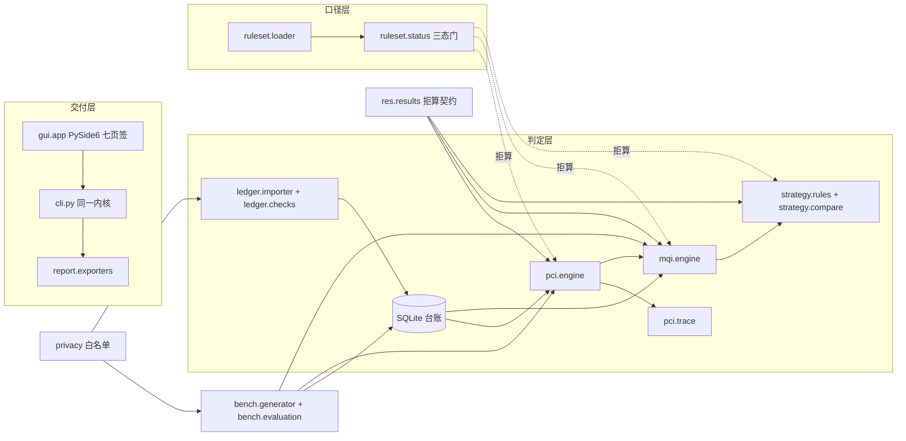

# 开发计划与架构（M0 交付）

> 回答三个问题：**怎么分层实现**、**每个里程碑做到什么程度算完**、**哪些约定一旦改动会打挂基准**。
> 题目范围与红线见 `01-题目与任务要求.md`，本文件不重复题目要求，只写工程落地。
> 版本：v1（2026-10-07，M0 定稿）

---

## 一、技术选型与弃选项

| 面 | 选择 | 理由 | 弃选项与代价 |
|---|---|---|---|
| 语言/下限 | Python **3.8**（`requires-python >=3.8`） | 受众含区县管养机构的旧电脑旧系统；打包通路（PySide6 6.6.3.1 on 3.8.8）已实测可行 | 弃 3.10 起步：语法自由但放弃"源码态在旧机器直接跑"的通路；代价是全部代码要守 3.8 兼容写法（无 `match`、无 `X | Y` 运行期联合、无 `tomllib`） |
| 核心依赖 | **零第三方依赖**（纯标准库） | 基准评测必须能在一台只装了 Python 的机器上跑完；依赖越少，干净环境验证越不会暴露"extras 漏声明" | 弃 pandas/numpy：路面检测表是行式小数据，`csv` + `sqlite3` 足够；引入即背上 wheel 兼容矩阵 |
| 存储 | **SQLite**（单文件台账） | 路段台账要持久、要多年度累积、要能被 Excel 之外的方式复算；单文件即"一条路每年的检测账"的载体 | 弃 CSV 目录当数据库：跨年划分变更与去重需要主键与索引；弃 Postgres：交付形态是免安装桌面 exe |
| 规则数据 | **JSON 规则集包**（随包发布 + 用户目录覆盖） | 每格系数要挂条款号与核对状态，JSON 好读好 diff 好挂来源；切换省份/年度 = 换文件 | 弃 YAML/TOML：3.8 无标准库解析器；弃数据库表存系数：规则集要能随包内嵌进 exe 并做字节对账 |
| 随机源 | **自研 splitmix64**（`bench/rng.py`） | 基准要跨机器跨解释器复现；stdlib random 不承诺序列一致 | 弃 `random`：会做出"我这能复现"的假基准 |
| GUI | **PySide6**（extras `gui`，惰性导入） | 免安装桌面交付；offscreen 测试通路成熟 | 弃 Tkinter：观感与控件能力不足以撑七个页签；弃 Web 面板：本题主形态是桌面 exe，Web 只在 M6 之后按需加 |
| 打包 | **PyInstaller onedir 双 exe**（GUI + 控制台 CLI） | 无 Python 的机器上仍可跑脚本化验证（selfcheck/bench） | 弃 onefile：内嵌数据目录与杀毒误报麻烦 |
| LLM | **不用** | 题目要求规则优先、纯算术、可复算；数值结论一律来自确定性规则 | 弃"LLM 兜底解析"：CSV/桩号是结构化输入，规则解析失败应当**拒入并出回执**，而不是猜 |

---

## 二、分层架构与数据流

三条横切纪律的落点：**离线** = `errors`+`ruleset`+`tests/test_gates_offline.py`；
**三态拒算** = `ruleset.status` + `results` 契约；**确定性** = `bench.rng` + `pci.engine.quantize` + `strategy.rules.TIE_BREAK_KEYS`。

---

## 三、模块到包路径的映射（五模块 → 代码）

| 题目模块 | 包路径 | 里程碑 | M0 已就位 | 待实现 |
|---|---|---|---|---|
| 1 台账与导入 | `ledger.models` / `ledger.db` | M0 | 字段契约、七张表 DDL、幂等建表、划分变更类别 | — |
| 1 台账与导入 | `ledger.importer` | M1 | 回执列名 `RECEIPT_COLUMNS`、拒因代码 `REJECT_CODES` | CSV 入库、去重、预检 |
| 1 台账与导入 | `ledger.checks` | M1 | 校验项词汇 `CHECK_KINDS` | 悬空/重叠/闭合差/字典/量纲/负值/重复/划分变更 |
| 2 PCI 评定 | `pci.engine` | M2 | 固定舍入 `quantize`（半值向上，锁 1 位小数） | 破损→扣分比率换算、分项合成、blocked 构造 |
| 2 PCI 评定 | `pci.trace` | M2 | 展开视图列 `TRACE_COLUMNS` | 逐条贡献计算与排序 |
| 3 规则与条款 | `ruleset.status` / `ruleset.loader` | M3 是**数据活**（逐格核对原文入库），代码门已在 M0 | 三态 + schema 硬门 + 版本化选取 + 夹具双通路 | 把 `rulesets/base-jtg5210-2018.json` 的 pending 逐格转 verified |
| 4 MQI 汇总 | `mqi.engine` | M4 | 等级词汇、分项可用性口径、部分口径声明前缀 | 三级里程加权、分级判定 |
| 4 对策与对比 | `strategy.rules` | M4 | 条件比较符、固定次级键 `TIE_BREAK_KEYS` | IF/THEN 规则链、优先序排序 |
| 4 对策与对比 | `strategy.compare` | M4 | 不可比原因代码、对比列名 | 差值、劣化速率、变化贡献拆解 |
| 5 基准 | `bench.rng` | M0 | splitmix64 全实现 + 冻结向量 | — |
| 5 基准 | `bench.generator` | M1 | 模式词汇、真值列名、SYNTHETIC 标记、默认规模与 seed | 生成 raw+truth+manifest 并位级一致 |
| 5 基准 | `bench.evaluation` | M5 | 四态指标口径 + 状态→退出码映射（已锁） | 指标计算、门禁脚本、报告生成 |
| 交付 | `report.disclaimer` | M0 | 固定免责声明 + 措辞纪律闸门 | — |
| 交付 | `report.exporters` | M6 | 格式词汇、优先序导出列名 | csv/md/docx 导出（docx 走标准库直写 OOXML） |
| 交付 | `gui.app` | M6 | 七页签结构与"页签→命令"映射、Qt 惰性导入 | 主窗口、导入向导、贡献展开视图 |
| 横切 | `privacy` | M0 | 白名单正则 + 整行校验 + 措辞纪律 | 生成器/导入器接入 |
| 横切 | `data_paths` | M0 | 五级优先级（含冻结分支） | 打包态实测 |
| 横切 | `results` | M0 | 拒算契约（blocked/uncomparable 数值字段全空） | 各引擎接入 |
| 横切 | `exit_codes` / `errors` / `_meta` | M0 | 退出码语义、异常族、占位符登记表 | — |

---

## 四、系数三态与拒算口径（本题的命门）

题目纪律"未完成原文核对的系数一律不得进入评定路径"落成四道代码门：

1. **状态门**（`ruleset/status.py`）：`pending / located / verified / fixture` 四档；只有 `verified`（和仅测试可用的 `fixture`）能驱动数值。`located`（条号已按原文定位、数值未取到）与 `pending` 一起被挡在外面，但两档必须并存——核对队列按"核完这一格能解锁多少项判定"排序，二态模型会让这个排序失去信息。
2. **schema 门**（`ruleset/loader.py`）：自称 `verified` 却 `values` 为空 → 拒绝整包加载；状态为 `pending/located` 却带数值 → 拒绝；`located/verified` 缺 `clause/channel/verified_at/locator` 任一 → 拒绝。未核对的阈值一律写 `null`，而不是写一个"看起来合理"的数。
3. **反向索引门**：系数生效档位取 `min(系数自身状态, 各依据条款状态)`。缺这一条，PCI 合成分项可以在权重未核对的情况下自称已核对。
4. **出口契约门**（`results.py`）：`blocked` 与 `uncomparable` 的结果对象数值字段必须全空——不是 0、不是 NaN、不是"仅供参考"；`partial` 必须带口径声明；对策建议必须挂规则 id + 条款号 + 触发来源。

夹具双通路：`fixture` 档只允许出现在 `tests/fixtures/`，`tests/test_release_redlines.py` 反向断言 `data/` 与内置规则集里出现 `fixture` 字样即失败；夹具数值刻意避开任何真实规范数字。

**M3 的查证队列**（先解锁面大的）：
`deduct_ratio.asphalt_distress` → `deduct_ratio.cement_distress` → `pci_weight.asphalt|cement` →
`pci_component.ride_quality|rutting|skid_resistance` → `grade_threshold.pci|mqi` →
`mqi_weight.pavement` → `action_rule.maintenance_trigger` → `tolerance.length_closure`（用户自定，显式登记即可）。
每格入库前必须在 `data/README.md` §一 换取证渠道（官方公告页/标准原文电子版），并逐格核对后改 `status`。

---

## 五、确定性与复现纪律

| 纪律 | 落点 | 门 |
|---|---|---|
| 随机源只有 splitmix64，固定 seed | `bench.rng` | `tests/test_determinism_rng.py` 冻结向量；`test_gates_offline.py` 禁 stdlib random |
| 浮点比较用固定舍入（半值向上，PCI 1 位小数） | `pci.engine.quantize` | 数值通路测试（M2 起）比对两次重跑 |
| 排序必须有固定次级键 | `strategy.rules.TIE_BREAK_KEYS` | 规则集选取本身也测"目录顺序无关" |
| 落盘产物不带时间戳 | `ledger.db`（表不带 created_at）、`bench.generator`（M1） | 生成器 `--force` 重跑 `git status` 零变化 |
| 产物逐字节一致（含 EOL） | `.gitattributes` `* text=auto eol=lf` | `tests/test_gates_eol.py` 扫跟踪文本文件 CR 字节 |
| 基准可在干净环境一键复现 | `rmqc bench generate` + `rmqc bench run` | 依赖清单 = 核心零依赖 + dev 组；CI 四矩阵 |

---

## 六、CLI 命令面与退出码

命令面（`rmqc <command>`，与 `python -m road_mqi_checker` 等价）：

| 命令 | 作用 | 可用里程碑 | 说明 |
|---|---|---|---|
| `version` | 打印版本与里程碑 | M0 | |
| `selfcheck` | 内核自检：数据目录/规则集/系数门/台账 schema | M0 | 断网可跑；`--json` 出结构 |
| `ruleset list/show` | 列出与选取规则集包 | M0 | `--province --year --surface` |
| `ledger init/tables` | 建台账库、查表结构 | M0 | `--db PATH` 落盘，省略则内存库 |
| `import --file --year [--dry-run]` | 年度检测表入库 + 回执 | M1 | |
| `assess --year [--segment]` | 逐路段 PCI 评定与贡献展开 | M2 | |
| `aggregate --year [--level]` | 路段/路线/路网 MQI 与分级 | M4 | |
| `compare --from-year --to-year` | 年对比、劣化速率、优先序 | M4 | |
| `bench generate --seed --out` / `bench run` | 合成数据 / 基准评测 | M1 / M5 | |
| `report --format csv\|md\|docx --out` | 导出清单与报告 | M6 | |
| `gui` | 启动桌面壳 | M6 | 缺 PySide6 给 extras 提示 |

退出码（单点定义在 `exit_codes.py`，`EXIT_CODE_MEANINGS` 被 README 与测试共同对账）：

- `0` 完成
- `1` 降级完成（存在 blocked / uncomparable / partial 项，或可选依赖缺失）
- `2` 输入不可用（文件、台账、规则集选不出，未进入评定路径）
- `3` 尚未实现（属未来里程碑，明确拒绝而不是假装成功）

基准四态映射：达标→0、未达标→1、不可判（分母为 0）→2、不可用（通路拿不到）→3。M0 时全部指标为"不可用"，README 指标表如实显示。

校验项词汇（`ledger.checks.CHECK_KINDS`）、拒因代码（`ledger.importer.REJECT_CODES`）、真值列名（`bench.generator.TRUTH_COLUMNS`）、导出列名（`report.exporters.PLAN_COLUMNS`）都在代码里单点定义，文档只引用不另写一套。

---

## 七、M0 已立的守门测试清单

| 测试文件 | 守住的口径 | 打挂它的是什么动作 |
|---|---|---|
| `test_gates_workflow.py` | CI YAML 可解析、每 job 有 runs-on/steps、矩阵含 3.8+3.12、升级 pip 在安装之前 | 非法 YAML（GitHub 会一个 job 都不建）、矩阵悄悄缩档 |
| `test_gates_pyproject.py` | 核心零依赖、dev 覆盖测试期 import、重依赖按解释器写上界、package-data 收规则集 | 漏声明依赖导致 CI 静默少跑；旧解释器解析到破坏版本 |
| `test_gates_offline.py` | 无联网/LLM 词法 + **断网探针**跑通 selfcheck + 禁 stdlib random | 悄悄引入网络依赖或随机源 |
| `test_gates_eol.py` | `eol=lf` 声明 + 跟踪文本文件无 CR + data 四类目录在 + 标准 PDF 被忽略 | 干净 clone 里基准全挂；版权红线破口 |
| `test_ruleset_status.py` | 三态语义、schema 四道硬门、夹具双通路、选取最具体优先且与目录顺序无关 | 凭记忆填数、未核对冒充已核对、排序不确定 |
| `test_ruleset_builtin.py` | 内置包全 pending、无数字、每格有 `data/README.md#N` 出处且指向确实存在的依据行 | 系数出处漂移、悄悄塞进"临时值" |
| `test_results_contract.py` | blocked/uncomparable 数值字段全空、NaN 拒绝、partial 必带口径、贡献项必挂条款 | 绕过加载层直接造结果 |
| `test_cli_contract.py` | 退出码四态、占位符命令返回 3 且指明里程碑、README 与代码同源 | 命令面改名/语义漂移 |
| `test_placeholder_registry.py` | 占位符登记表 ↔ 代码 ↔ plan/02 三方对账，无幽灵模块 | 文档写了但代码没有；代码拒了但文档没记 |
| `test_determinism_rng.py` | 冻结随机向量、两次实例化一致、边界与非法输入 | 换随机源实现导致基准不可复现 |
| `test_data_paths.py` | 五级优先级与冻结分支 | exe 内嵌数据查找优先级被改动 |
| `test_ledger_structure.py` | 建表幂等、异常值可入库、缺测是 None 不是 0 | 数据库 CHECK 把待检出对象挡在门外 |
| `test_privacy_whitelist.py` | 白名单正例过、真实形态一律拒、代码与 data/README 登记一致 | 真实路线号/行政代码/号段混进演示数据 |
| `test_release_redlines.py` | 夹具不污染交付面、导出必带免责声明、措辞纪律、README 不许吹已实现、无未登记二进制、**src/tests 与 `git ls-files` 对账** | 发布期返工最贵的四类事故（含 ignore 规则吞掉源码包导致新 clone 缺件） |

---

## 八、里程碑细化与 DoD

> 一里程碑一对话；每个里程碑收尾写 `plan/HANDOFF-M<next>.md` 再结束会话。

### M0 骨架与纪律（本文件，已完成）

- [x] 计划文档（本文件）+ 索引重编号 + 决策记录回写
- [x] 可安装包骨架：`src/` 布局、pyproject、extras、console script、CI 四矩阵、MIT、`.gitattributes`
- [x] 契约层：三态与 schema 门、拒算契约、台账 DDL、CLI 命令面与退出码、`find_data_dir`、白名单、随机源
- [x] 内置规则集包：15 格系数全 pending、逐格挂依据台账行号
- [x] 守门测试全绿（py3.8 + py3.12 双通道，各收集 159 项、各 159 通过、0 skip、0 warning）
- [x] 全新 clone 自足性验证：`.tmp_verify/` 下 `git clone` 后双解释器 159 全绿、`selfcheck` 返回 0、
  `core.autocrlf=true` 环境下 CR 门通过（证明 `eol=lf` 声明真的生效、LF 未被检出污染）
- 偏差说明：① `pip install -e .[dev]` 的**干净 venv 安装**通路未实跑（需联网取 setuptools/wheel，本机代理不稳），
  README 已按 skill 写明三步前置（`install -U pip setuptools wheel` → `pip install -e .[dev]`、
  激活后用 `python -m pip` 而非 `py`），M1 收尾按 README 原文逐字补跑一次；
  ② 本轮以 `PYTHONPATH=src` 通道跑测试与 CLI，等价于安装后的入口（`rmqc` 控制台脚本未实测，同属 ①）。

### M1 数据先行（下一棒）

范围：`bench.generator` 生成 3 条虚拟路线 × 4 个年度的检测表 + 真值；`ledger.importer` 入库出回执；`ledger.checks` 七类校验全实现。
出口判据（DoD）：
- [ ] `rmqc bench generate --seed 20261007` 两次运行产物逐字节一致（`git status` 零变化）
- [ ] 生成的演示目录整体作为**冻结 fixtures 入仓**，配"再生成位级一致"守门测试
- [ ] 每类 `injected_issue` 至少 2 个用例；异常识别有召回与误报的实测数
- [ ] `rmqc import --dry-run` 出回执（入库/拒入行数 + 逐条拒因），真实形态标识符被白名单拒绝
- [ ] 跨年度划分变更四类（new/disappeared/merged/split）都有用例并显式标"不可比"
- [ ] `plan/03-数据字典与合成数据.md` 完成（字段表 + 单位 + 拒因代码 + 真值语义）

### M2 评定内核

范围：`pci.engine` + `pci.trace`（数值通路先用夹具档跑，真实系数仍全 pending）。
- [ ] 沥青与水泥两套破损→扣分换算各自有黄金用例
- [ ] 同数据重跑误差 0；贡献项可展开到"哪条破损哪个程度扣了多少"
- [ ] 未核对系数存在时结果为 blocked 且数值字段全空（用真实规则集断言，夹具只在测试里）
- [ ] `plan/05-评定与汇总算法说明.md` 的 PCI 部分完成

### M3 规则与条款（查证活）

范围：逐格核对 JTG 5210-2018 原文，把 `rulesets/base-jtg5210-2018.json` 的 pending 转 verified，`data/README.md` 台账同步。
- [ ] 每个生效系数有 `clause/channel/verified_at/locator` 四件套，渠道为官方页面或标准原文电子版
- [ ] 抓取缓存落 `.tmp_verify/M3/<批次>/` 并带 manifest（URL + HTTP 码 + 字节数 + sha1），收尾不删
- [ ] 核对不通过的格子留在 pending 并在台账记录已查渠道
- [ ] `plan/04-扣分规则集与条款映射.md` 完成（逐格条款映射 + 地方细则差异说明）

### M4 汇总、对策与年对比

- [ ] 三级 MQI 加权口径一致（路段→路线→路网同一套权重来源）
- [ ] "分项不全不得冒充完整 MQI"由测试锁定：`partial` 必带口径声明
- [ ] 对策规则链每条挂条款号；同分排序稳定（次级键固定）
- [ ] 年对比：不可比时拒出变化率；变化能拆到贡献项
- [ ] `plan/05` 的汇总与分级部分完成

### M5 基准与评测

- [ ] 四类指标可计算：复算误差=0、等级判定准确率、贡献排序一致性、异常召回/误报
- [ ] 指标表由命令生成（`rmqc bench run --json`），README 表格与实跑逐行对账
- [ ] 门禁脚本只红于"未达标 / 不可用 / 名单外新不可判"
- [ ] 干净环境一键复现（新 clone + 新 venv）
- [ ] `plan/06-基准与评测.md` 完成（黄金用例 + 指标定义 + 复现命令）

### M6 交付、打包与发布

- [ ] `gui.app` 七页签接通 CLI 通路（不另起第二套行为）；offscreen 测试常驻
- [ ] 报告导出 csv/md/docx（docx 用标准库直写 OOXML + 固定 ZipInfo，无 python-docx）
- [ ] PyInstaller onedir 双 exe + `spec datas` 白名单 + 构建后递归红线断言（内嵌数据与仓库逐份 sha 对账）
- [ ] 中立目录 + `env -i` 下 CLI 五连 + GUI 存活探针
- [ ] 脱敏四步 + 构建产物本体扫描 + 提交邮箱全历史核查，留档 `plan/RELEASE-M6.md`
- [ ] 建仓 push（用户授权后）、CI 四矩阵首跑全绿、tag + release、README 状态行转正

---

## 九、既定口径清单（动了会打挂基准）

1. 三态词汇 `pending/located/verified` + 夹具档 `fixture`；`fixture` 只存在于 `tests/fixtures/`。
2. 系数生效档位 = `min(系数状态, 各依据条款状态)`；blocked/uncomparable 结果数值字段全空。
3. 舍入口径：`quantize` 半值向上，PCI/MQI 保留 1 位小数（`pci.engine.PCI_DECIMALS`）。
4. 随机源 = splitmix64 + 冻结向量；默认 seed `20261007`；规模口径 3 路线 × 4 年度。
5. 真值列名、回执列名、拒因代码、校验项词汇、导出列名、对比列名 —— 单点定义在代码里。
6. 退出码 0/1/2/3 与基准四态映射。
7. 规则集 `schema_version`、`applies_to` 三维匹配与"最具体优先 + 字典序次级键"。
8. `find_data_dir` 五级优先级顺序。
9. 合成数据白名单形式（与 `data/README.md` §三 同步）；结论文本禁"已确认/已核实/最终确定"。
10. 落盘产物无时间戳；`.gitattributes` 强制 LF。
11. CLI 命令名与其页签映射（GUI 只转发）。

---

## 十、开放项（需外部动作或用户确认）

| # | 事项 | 归属 | 现状 |
|---|---|---|---|
| 1 | JTG 5210-2018 官方公告页/原文电子版获取 | M3 前置 | ⬜ 未取到官方渠道（多源二手），拿到前所有系数保持 pending |
| 2 | "公路养护技术标准 / JTG 5142-2019"编号-名称对应关系 | M3/M4 | ❌ 查证失败，暂不引用；对策规则只挂已确认的评定标准条款 |
| 3 | 地方细则差异样本（省份包） | M3 | ⬜ 待按目标受众省份逐省检索；未核对者只能作"用户自定规则" |
| 4 | 闭合差容差、缺测处理口径等用户自定系数 | M1/M4 | ⬜ 默认值不硬编码，必须由规则集或导入参数显式给出 |
| 5 | 是否补 Web 面板（当前只做桌面 + CLI） | M6 之后 | 缓议：桌面形态已满足"双击完成导入→导出"，Web 属可选加分 |
| 6 | 建仓与 push 授权 | M6 | 用户已定"本轮只本地 commit"，公开前需再次确认 |
| 7 | 干净环境 `pip install -e .` 实跑验证 | M1 收尾 | ⬜ 需联网装构建前端，本机代理不稳，按 skill 的 NO_PROXY/镜像源绕法执行 |

---

## 十一、发布面前置工程（现在就在做，不是 M6 才补）

- `.gitattributes` `* text=auto eol=lf` + CR 守门测试（EOL 门）；
- extras 含**测试期**依赖声明，CI 显式 `pip install -e .[dev]`（防静默少跑）；
- CI 四矩阵（ubuntu/windows × 3.8/3.12）+ workflow YAML 可解析守门（发票台账实录）；
- 3.8 兼容写法（`typing.Dict/List`、`# type:` 注释、无 match）；
- README 快速开始按"原味 venv"可跑：`py -m venv` + 激活 + `python -m pip install -U pip setuptools wheel` + `pip install -e .[dev]`（`py` 启动器会无视 venv，所以激活后一律用 `python -m pip`）；
- 脱敏面预留：`.gitignore` 已覆盖 `_private/`、`data/raw/real_*`、`data/standards/*.pdf`、`.env`；scratch 只落 `.tmp_*/`（扫描器与字节门跳过名单）；提交邮箱已是 GitHub noreply 形态；
- 品牌隔离：仓库内不提及任何其他工程类工具项目，方法论同源但仓库独立。
