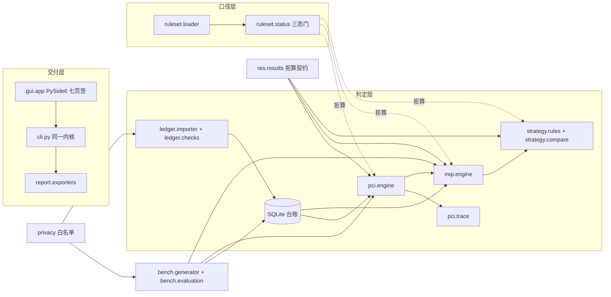

# 开发计划与架构（M0 交付）

> 回答三个问题：**怎么分层实现**、**每个里程碑做到什么程度算完**、**哪些约定一旦改动会打挂基准**。
> 题目范围与红线见 `01-题目与任务要求.md`，本文件不重复题目要求，只写工程落地。
> 版本：v1（2026-10-07，M0 定稿）

---

## 一、技术选型与弃选项

| 面 | 选择 | 理由 | 弃选项与代价 |
|---|---|---|---|
| 语言/下限 | Python **3.8**（`requires-python >=3.8`） | 受众含区县管养机构的旧电脑旧系统；打包通路（PySide6 6.6.3.1 on 3.8.8）已实测可行 | 弃 3.10 起步：语法自由但放弃"源码态在旧机器直接跑"的通路；代价是全部代码要守 3.8 兼容写法（无 `match`、无 `X | Y` 运行期联合、无 `tomllib`） |
| 核心依赖 | **零第三方依赖**（纯标准库） | 基准评测必须能在一台只装了 Python 的机器上跑完；依赖越少，干净环境验证越不会暴露"extras 漏声明" | 弃 pandas/numpy：路面检测表是行式小数据，`csv` + `sqlite3` 足够；引入即背上 wheel 兼容矩阵 |
| 存储 | **SQLite**（单文件台账） | 路段台账要持久、要多年度累积、要能被 Excel 之外的方式复算；单文件即"一条路每年的检测账"的载体 | 弃 CSV 目录当数据库：跨年划分变更与去重需要主键与索引；弃 Postgres：交付形态是免安装桌面 exe |
| 规则数据 | **JSON 规则集包**（随包发布 + 用户目录覆盖） | 每格系数要挂条款号与核对状态，JSON 好读好 diff 好挂来源；切换省份/年度 = 换文件 | 弃 YAML/TOML：3.8 无标准库解析器；弃数据库表存系数：规则集要能随包内嵌进 exe 并做字节对账 |
| 随机源 | **自研 splitmix64**（`bench/rng.py`） | 基准要跨机器跨解释器复现；stdlib random 不承诺序列一致 | 弃 `random`：会做出"我这能复现"的假基准 |
| GUI | **PySide6**（extras `gui`，惰性导入） | 免安装桌面交付；offscreen 测试通路成熟 | 弃 Tkinter：观感与控件能力不足以撑七个页签；弃 Web 面板：本题主形态是桌面 exe，Web 只在 M6 之后按需加 |
| 打包 | **PyInstaller onedir 双 exe**（GUI + 控制台 CLI） | 无 Python 的机器上仍可跑脚本化验证（selfcheck/bench） | 弃 onefile：内嵌数据目录与杀毒误报麻烦 |
| LLM | **不用** | 题目要求规则优先、纯算术、可复算；数值结论一律来自确定性规则 | 弃"LLM 兜底解析"：CSV/桩号是结构化输入，规则解析失败应当**拒入并出回执**，而不是猜 |

---

## 二、分层架构与数据流

三条横切纪律的落点：**离线** = `errors`+`ruleset`+`tests/test_gates_offline.py`；
**三态拒算** = `ruleset.status` + `results` 契约；**确定性** = `bench.rng` + `pci.engine.quantize` + `strategy.rules.TIE_BREAK_KEYS`。

---

## 三、模块到包路径的映射（五模块 → 代码）

| 题目模块 | 包路径 | 里程碑 | M0 已就位 | 待实现 |
|---|---|---|---|---|
| 1 台账与导入 | `ledger.models` / `ledger.db` | M0 | 字段契约、七张表 DDL、幂等建表、划分变更类别 | — |
| 1 台账与导入 | `ledger.importer` | M1 | 回执列名 `RECEIPT_COLUMNS`、拒因代码 `REJECT_CODES` | ✅ M1 已交付：CSV 入库、按 digest 去重、预检、数据类别闸门 |
| 1 台账与导入 | `ledger.checks` | M1 | 校验项词汇 `CHECK_KINDS` | ✅ M1 已交付：悬空/重叠/闭合差/字典/量纲/负值超范围/重复/划分变更八类 |
| 2 PCI 评定 | `pci.engine` | M2 | 固定舍入 `quantize`（半值向上，锁 1 位小数） | ✅ M2 已交付：两套破损→扣分换算、分项合成、`surface_table_keys` 必需格集合、blocked 构造（系数门 + 数据门 + 检出项门） |
| 2 PCI 评定 | `pci.trace` | M2 | 展开视图列 `TRACE_COLUMNS` | ✅ M2 已交付：逐条贡献折算到 PCI 尺度、固定次级键排序、回指台账/原始文件行号 |
| 3 规则与条款 | `ruleset.status` / `ruleset.loader` | M3 是**数据活**（逐格核对原文入库），代码门已在 M0 | 三态 + schema 硬门 + 版本化选取 + 夹具双通路 | 把 `rulesets/base-jtg5210-2018.json` 的 pending 逐格转 verified |
| 4 MQI 汇总 | `mqi.engine` | M4 | 等级词汇、分项可用性口径、部分口径声明前缀 | ✅ M4 已交付：三级里程加权（同一分母口径）、必需格门、部分口径声明、分级判定（`grade_threshold.mqi` 含界与否） |
| 4 对策与对比 | `strategy.rules` | M4 | 条件比较符、固定次级键 `TIE_BREAK_KEYS` | ✅ M4 已交付：IF/THEN 规则链（登记顺序首条命中）、三种拒算原因、优先序排序（主键可配 + 次级键固定 + 空值排后） |
| 4 对策与对比 | `strategy.compare` | M4 | 不可比原因代码、对比列名 | ✅ M4 已交付：消费 `partition_change` 出 `uncomparable`（拒出变化率）、差值与劣化速率、变化拆到贡献项 |
| 5 基准 | `bench.rng` | M0 | splitmix64 全实现 + 冻结向量 | — |
| 5 基准 | `bench.generator` | M1 | 模式词汇、真值列名、SYNTHETIC 标记、默认规模与 seed | ✅ M1 已交付：raw + truth + manifest，位级一致，八类注入 19 例 |
| 5 基准 | `bench.evaluation` | M5 | 四态指标口径 + 状态→退出码映射（已锁） | ✅ M5 已交付：8 指标 × 两通路（内置包=交付面 / 夹具包=数值通路）= 16 行，每行显式报分子/分母/状态/判据/说明/目标/退出码；`DECLARED_INDETERMINATE` 声明式豁免名单；`gate()` 只红于三类（未达标 1 > 不可用 3 > 名单外新不可判 2）；README 评测表由 `render_readme_block()` 生成（报告导出 csv/md/docx 仍属 M6） |
| 交付 | `report.disclaimer` | M0 | 固定免责声明 + 措辞纪律闸门 | — |
| 交付 | `report.exporters` | M6 | 格式词汇、优先序导出列名 | csv/md/docx 导出（docx 走标准库直写 OOXML） |
| 交付 | `gui.app` | M6 | 七页签结构与"页签→命令"映射、Qt 惰性导入 | 主窗口、导入向导、贡献展开视图 |
| 横切 | `privacy` | M0 | 白名单正则 + 整行校验 + 措辞纪律 | 生成器/导入器接入 |
| 横切 | `data_paths` | M0 | 五级优先级（含冻结分支） | 打包态实测 |
| 横切 | `results` | M0 | 拒算契约（blocked/uncomparable 数值字段全空） | 各引擎接入 |
| 横切 | `exit_codes` / `errors` / `_meta` | M0 | 退出码语义、异常族、占位符登记表 | — |

---

## 四、系数三态与拒算口径（本题的命门）

题目纪律"未完成原文核对的系数一律不得进入评定路径"落成四道代码门：

1. **状态门**（`ruleset/status.py`）：`pending / located / verified / fixture` 四档；只有 `verified`（和仅测试可用的 `fixture`）能驱动数值。`located`（条号已按原文定位、数值未取到）与 `pending` 一起被挡在外面，但两档必须并存——核对队列按"核完这一格能解锁多少项判定"排序，二态模型会让这个排序失去信息。
2. **schema 门**（`ruleset/loader.py`）：自称 `verified` 却 `values` 为空 → 拒绝整包加载；状态为 `pending/located` 却带数值 → 拒绝；`located/verified` 缺 `clause/channel/verified_at/locator` 任一 → 拒绝。未核对的阈值一律写 `null`，而不是写一个"看起来合理"的数。
3. **反向索引门**：系数生效档位取 `min(系数自身状态, 各依据条款状态)`。缺这一条，PCI 合成分项可以在权重未核对的情况下自称已核对。
4. **出口契约门**（`results.py`）：`blocked` 与 `uncomparable` 的结果对象数值字段必须全空——不是 0、不是 NaN、不是"仅供参考"；`partial` 必须带口径声明；对策建议必须挂规则 id + 条款号 + 触发来源。

夹具双通路：`fixture` 档只允许出现在 `tests/fixtures/`，`tests/test_release_redlines.py` 反向断言 `data/` 与内置规则集里出现 `fixture` 字样即失败；夹具数值刻意避开任何真实规范数字。

**M3 的查证队列**（先解锁面大的）：
`deduct_ratio.asphalt_distress` → `deduct_ratio.cement_distress` → `pci_weight.asphalt|cement` →
`pci_component.ride_quality|rutting|skid_resistance` → `grade_threshold.pci|mqi` →
`mqi_weight.pavement` → `action_rule.maintenance_trigger` → `tolerance.length_closure`（用户自定，显式登记即可）。
每格入库前必须在 `data/README.md` §一 换取证渠道（官方公告页/标准原文电子版），并逐格核对后改 `status`。

---

## 五、确定性与复现纪律

| 纪律 | 落点 | 门 |
|---|---|---|
| 随机源只有 splitmix64，固定 seed | `bench.rng` | `tests/test_determinism_rng.py` 冻结向量；`test_gates_offline.py` 禁 stdlib random |
| 浮点比较用固定舍入（半值向上，PCI 1 位小数） | `pci.engine.quantize` | ✅ M2 起数值通路比对两次重跑 + 两次进程冷启动 stdout 逐字节一致（`test_m2_assess.py`） |
| 排序必须有固定次级键 | `strategy.rules.TIE_BREAK_KEYS`（M4）、`pci.trace.TRACE_ORDER_KEYS`（M2 已落地） | 规则集选取本身也测"目录顺序无关"；贡献清单逐位旋转与反序后展开视图逐行一致（`test_m2_trace.py`） |
| 落盘产物不带时间戳 | `ledger.db`（表不带 created_at）、`bench.generator`（M1 已落地） | 生成器 `--force` 重跑 `git status` 零变化 + `test_products_have_no_timestamp_shape` |
| 产物逐字节一致（含 EOL） | `.gitattributes` `* text=auto eol=lf` | `tests/test_gates_eol.py` 扫跟踪文本文件 CR 字节 |
| 基准可在干净环境一键复现 | `rmqc bench generate` + `rmqc bench run` | 依赖清单 = 核心零依赖 + dev 组；CI 四矩阵（矩阵跑的 `pytest` 自 M5 起把 `bench run` 的实测也带上：两通路 16 行、CLI 文本与 `--json` 同一退出码、README 评测表逐行对账；`bench run` 的产物只写系统临时目录，不落仓库） |

---

## 六、CLI 命令面与退出码

命令面（`rmqc <command>`，与 `python -m road_mqi_checker` 等价）：

| 命令 | 作用 | 可用里程碑 | 说明 |
|---|---|---|---|
| `version` | 打印版本与里程碑 | M0 | |
| `selfcheck` | 内核自检：数据目录/规则集/系数门/台账 schema | M0 | 断网可跑；`--json` 出结构 |
| `ruleset list/show` | 列出与选取规则集包 | M0 | `--province --year --surface` |
| `ledger init/tables` | 建台账库、查表结构 | M0 | `--db PATH` 落盘，省略则内存库 |
| `import --file --year [--dry-run] [--data-class]` | 年度检测表入库 + 回执 + 八类校验 | ✅ M1 | 有拒入行落 1（降级完成）；预检不写库也不报校验结论 |
| `assess --year [--segment]` | 逐路段 PCI 评定与贡献展开 | ✅ M2 | 存在 blocked/partial 落 1（降级完成）；该年度无路段行落 2 |
| `aggregate --year [--level]` | 路段/路线/路网 MQI 与分级、对策优先序 | ✅ M4 | 存在 blocked/partial 落 1；该年度无路段行落 2；部分口径不得冒充完整 MQI |
| `compare --from-year --to-year [--segment]` | 年对比、劣化速率、变化贡献项 | ✅ M4 | 不可比对象出 `uncomparable` 且不出变化率；默认对比"任一年出现过的路段"（并集） |
| `bench generate --seed --out [--force]` / `bench run` | 合成数据 / 基准评测 | ✅ M1 / ✅ M5 | 冻结 fixtures 已入仓；重跑要显式 `--force`；`bench run` 退出码取 `evaluation.gate()` 的结果（未达标→1 > 不可用→3 > 名单外新不可判→2 > 其余→0，单行映射仍是 `STATE_TO_EXIT`），`--seed` 给非默认值落 2（基准定义在 seed=20261007 的冻结演示数据上） |
| `report --format csv\|md\|docx --out` | 导出清单与报告 | M6 | |
| `gui` | 启动桌面壳 | M6 | 缺 PySide6 给 extras 提示 |

退出码（单点定义在 `exit_codes.py`，`EXIT_CODE_MEANINGS` 被 README 与测试共同对账）：

- `0` 完成
- `1` 降级完成（存在 blocked / uncomparable / partial 项，或可选依赖缺失）
- `2` 输入不可用（文件、台账、规则集选不出，未进入评定路径）
- `3` 尚未实现（属未来里程碑，明确拒绝而不是假装成功）

基准四态映射：达标→0、未达标→1、不可判（分母为 0）→2、不可用（通路拿不到）→3。M0 时全部指标为"不可用"，README 指标表如实显示。
M5 之后这张表两条通路都真跑，今天整体落 0：16 行 = 达标 10 / 不可判 6 / 未达标 0 / 不可用 0，而"不可判"那 6 行全在
`evaluation.DECLARED_INDETERMINATE` 名单里（门禁对名单内的不可判豁免，只红名单外的新增），所以剩下的不是"没做"而是"如实判不了"；
`bench run` 已退出"尚未实现"那一档，命令面上仍返回 3 的是 `report` / `gui`（M6）。

校验项词汇（`ledger.checks.CHECK_KINDS`）、拒因代码（`ledger.importer.REJECT_CODES`）、真值列名（`bench.generator.TRUTH_COLUMNS`）、导出列名（`report.exporters.PLAN_COLUMNS`）都在代码里单点定义，文档只引用不另写一套。

---

## 七、M0 已立的守门测试清单

| 测试文件 | 守住的口径 | 打挂它的是什么动作 |
|---|---|---|
| `test_gates_workflow.py` | CI YAML 可解析、每 job 有 runs-on/steps、矩阵含 3.8+3.12、升级 pip 在安装之前 | 非法 YAML（GitHub 会一个 job 都不建）、矩阵悄悄缩档 |
| `test_gates_pyproject.py` | 核心零依赖、dev 覆盖测试期 import、重依赖按解释器写上界、package-data 收规则集 | 漏声明依赖导致 CI 静默少跑；旧解释器解析到破坏版本 |
| `test_gates_offline.py` | 无联网/LLM 词法 + **断网探针**跑通 selfcheck + 禁 stdlib random | 悄悄引入网络依赖或随机源 |
| `test_gates_eol.py` | `eol=lf` 声明 + 跟踪文本文件无 CR + data 四类目录在 + 标准 PDF 被忽略 | 干净 clone 里基准全挂；版权红线破口 |
| `test_ruleset_status.py` | 三态语义、schema 四道硬门、夹具双通路、选取最具体优先且与目录顺序无关 | 凭记忆填数、未核对冒充已核对、排序不确定 |
| `test_ruleset_builtin.py` | M3 形态：每格要么 `verified` + 四件套齐全、要么 `pending` + `values` 为 null；规范来源格无官方渠道不得生效；生效格 values 过形状契约（含坏形状反例）；每格有 `data/README.md#N` 出处且该行真实存在 | 系数出处漂移、拿二手数值"顺手核完"、生效格形状与 `plan/05` §二 脱节 |
| `test_results_contract.py` | blocked/uncomparable 数值字段全空、NaN 拒绝、partial 必带口径、贡献项必挂条款 | 绕过加载层直接造结果 |
| `test_cli_contract.py` | 退出码四态、占位符命令返回 3 且指明里程碑、README 与代码同源、`STATE_TO_EXIT` 单行映射锁死；M5 把骨架期那张"指标全部不可用"的表**重写**成两通路真实四态（内置包数值类=不可判且分子分母都为 0、夹具包=出数并有实测值、一行都不许停在"不可用"上） | 命令面改名/语义漂移、把不可判挤成达标、让某一行退回"不可用"以求省事 |
| `test_placeholder_registry.py` | 占位符登记表 ↔ 代码 ↔ plan/02 三方对账，无幽灵模块；登记表随交付缩到 2 个（只剩 M6 的 `report.exporters` / `gui.app`），`_meta.MILESTONE` 随之走到 M5 | 文档写了但代码没有；代码拒了但文档没记 |
| `test_determinism_rng.py` | 冻结随机向量、两次实例化一致、边界与非法输入 | 换随机源实现导致基准不可复现 |
| `test_data_paths.py` | 五级优先级与冻结分支 | exe 内嵌数据查找优先级被改动 |
| `test_ledger_structure.py` | 建表幂等、异常值可入库、缺测是 None 不是 0 | 数据库 CHECK 把待检出对象挡在门外 |
| `test_privacy_whitelist.py` | 白名单正例过、真实形态一律拒、代码与 data/README 登记一致 | 真实路线号/行政代码/号段混进演示数据 |
| `test_release_redlines.py` | 夹具不污染交付面、导出必带免责声明、措辞纪律、README 不许吹已实现（状态行跟随 `_meta.MILESTONE`）、无未登记二进制、**src/tests 与 `git ls-files` 对账** | 发布期返工最贵的四类事故（含 ignore 规则吞掉源码包导致新 clone 缺件） |
| `test_m1_generator.py` | 生成器位级一致、幂等重跑、无 CR、无时间戳、八类注入各 ≥2 例且**不随 seed 漂移**、真值评分四列不出数、manifest 自描述与 sha1 自证 | 演示数据不可复现；真值里混进凭记忆填的分数 |
| `test_m1_pipeline.py` | 导入七表入库、异常值可入库、NULL 不是 0、dry-run 不写库、digest 去重留证、回执列名、真实形态标识符逐行拒入、召回 1.00 / 误报 0.00、闭合差不硬判（含"换成可计算状态就会判"的反证）、划分变更四类与不可比措辞；M5 起"注入类别 → 校验项"那张映射表**不再在测试里自写一份**，改为引用 `evaluation.EXPECTED_KIND_BY_ISSUE`（与 `bench run` 的召回分母同一张表） | 数据先行这条主证据链断裂；未核对系数被"平均一下"绕过；测试与基准各用一套注入类别词汇 |
| `test_gates_environment.py` + `support_git.py` | 闸门自身的环境稳健性：git 输出按 UTF-8 解码、交付面 = 已跟踪文件而非工作树（`.venv/` 与本地 sqlite 不算）、路径分隔符换算 | 干净环境里闸门自己假红/假死，问题被归错成"代码有问题" |
| `test_m2_pci_engine.py` | 两套换算的黄金用例（可手算）、必需系数集合与真值支配格一一对账、逐格缺失/退回 located 都拒算、无条款号拒算、换算端点与比率越界拒算、缺几何分母拒算、含异常行拒算（不跳过破损行）、分级边界开闭由规则集决定、同数据重跑逐字段相同 | 凭记忆把某个换算常数写进代码、"跳过可疑行算一个数"、引擎自己猜含界与否、真值与引擎各算一套 |
| `test_m2_trace.py` | 贡献必挂系数 key + 条款号 + 台账行号、`Σ 贡献 = 100 − PCI`（舍入残差上界）、贡献逐位旋转与反序后展开视图逐行一致、blocked 对象展开为空、`TRACE_COLUMNS` 列序 | 展开视图退化成"看起来像结论的 0 分"、排序依赖迭代顺序 |
| `test_m2_assess.py` | `assess` 退出码 0/1/2、`--segment` 过滤、JSON 结构可被 M4/M6 消费、内置规则集下全部 blocked 且数值字段全空、演示数据里三类异常对象逐个拒算、两次进程冷启动 stdout 逐字节一致、真值列与台账通路逐字段相等、M4 两列在夹具下出数 / 必需格未齐时仍令牌 | 命令面与内核漂移、真值接线假成功 |
| `test_m4_mqi.py` | 汇总必需格与真值支配格对账、内置包三级全 blocked、部分口径逐分项点名且不给等级、blocked 成员连同里程退出分子分母、三级同分母可互相复算、权重只从规则集来（换格就换数）、分级含界与否由规则集说 | 把缺数据当 0 分平均进上级、部分口径冒充完整 MQI、汇总层另起一套分母 |
| `test_m4_strategy.py` | 对策链每个对象一行、每条挂 rule_id + 条款号 + 触发来源、登记顺序首条命中、未触发/指标未出数/系数未核对三种拒算分开、规则形态坏值逐个拦下、排序旋转与反序不变、不可比五类划分变更全部拒出变化率、变化拆到贡献项且回指台账行号、口径不同与规则集版本不同都判不可比 | 给未触发编一个工程类别、按重叠里程摊分变化率、把不同分母的两个分数相减 |
| `test_m4_cli.py` | `aggregate` / `compare` 真跑（三级 blocked、`--json` 结构、`--segment` 过滤、退出码 1/2）、两次冷跑逐字节一致、`selfcheck` 的出数判据按必需格说话 | 命令面与内核漂移、"生效 1 格"被对外读成"某条路径可出数" |
| `test_m5_bench.py` | 两通路 16 行齐全且两条通路的措辞不互相顶替、内置包四项数值类指标必须"不可判且分母 0"、等级判定准确率在两通路都不许挤成达标、门禁只红于三类（未达标 / 不可用 / 名单外新不可判）且"名单内豁免"有正证与反证、README 评测表与 `bench run --json` 逐行对账、`bench run` 的 CLI 退出码与 `--json` 的 `gate.exit` 一致、`--seed` 非默认落 2、指标行构造时过措辞纪律、夹具包不在时该通路 8 行如实报"不可用"并落 3 | 为了表格好看把不可判改成达标、新增不可判不登记、README 表手抄、门禁把名单内不可判也判红、召回分母与校验项词汇脱节 |

---

## 八、里程碑细化与 DoD

> 一里程碑一对话；每个里程碑收尾写 `plan/HANDOFF-M<next>.md` 再结束会话。

### M0 骨架与纪律（本文件，已完成）

- [x] 计划文档（本文件）+ 索引重编号 + 决策记录回写
- [x] 可安装包骨架：`src/` 布局、pyproject、extras、console script、CI 四矩阵、MIT、`.gitattributes`
- [x] 契约层：三态与 schema 门、拒算契约、台账 DDL、CLI 命令面与退出码、`find_data_dir`、白名单、随机源
- [x] 内置规则集包：15 格系数全 pending、逐格挂依据台账行号（M3 轮后：14 格仍 pending，1 格用户自定容差转 verified；`assess` 仍不出数）
- [x] 守门测试全绿（py3.8 + py3.12 双通道，各收集 159 项、各 159 通过、0 skip、0 warning）
- [x] 全新 clone 自足性验证：`.tmp_verify/` 下 `git clone` 后双解释器 159 全绿、`selfcheck` 返回 0、
  `core.autocrlf=true` 环境下 CR 门通过（证明 `eol=lf` 声明真的生效、LF 未被检出污染）
- 偏差说明：① `pip install -e .[dev]` 的**干净 venv 安装**通路未实跑（需联网取 setuptools/wheel，本机代理不稳），
  README 已按 skill 写明三步前置（`install -U pip setuptools wheel` → `pip install -e .[dev]`、
  激活后用 `python -m pip` 而非 `py`），M1 收尾按 README 原文逐字补跑一次；
  ② 本轮以 `PYTHONPATH=src` 通道跑测试与 CLI，等价于安装后的入口（`rmqc` 控制台脚本未实测，同属 ①）。
  **①② 均已在 M1 收尾关闭**：新 clone + 新 venv 里 `rmqc` 控制台脚本实测可用，
  且该轮验证暴露并修好了三条闸门自身的环境 bug（详见 `plan/HANDOFF-M2.md` §〇 教训 4）。

### M1 数据先行（已完成，2026-10-07）

范围：`bench.generator` 生成 3 条虚拟路线 × 4 个年度的检测表 + 真值；`ledger.importer` 入库出回执；`ledger.checks` 八类校验全实现。
出口判据（DoD）：
- [x] `rmqc bench generate --seed 20261007` 两次运行产物逐字节一致（`git status` 零变化）
- [x] 生成的演示目录整体作为**冻结 fixtures 入仓**（`data/raw` 13 份 + `data/truth` 12 份），配"再生成位级一致"守门测试
- [x] 每类 `injected_issue` 至少 2 个用例（实测 19 例，八类分布见 `plan/03` §五）；异常识别召回 **1.00（19/19）**、误报 **0.00（0/32）**
- [x] `rmqc import --dry-run` 出回执（入库/拒入行数 + 逐条拒因），真实形态标识符被白名单拒绝（逐行 `R010`）
- [x] 跨年度划分变更四类（new/disappeared/merged/split）都有用例并显式标"不可比"（另加 shifted，共 13 条变更清单）
- [x] `plan/03-数据字典与合成数据.md` 完成（字段表 + 单位 + 拒因代码 + 真值语义）
- 偏差与新增口径：闭合差在容差 `pending` 时出"待核对，未判定"（并要求同时验证"换成可计算状态后真的会判"）；
  台账 schema 升 v2（`segment` 增三个可空列，几何上界要能从台账复算）；白名单改为按 `data_class` 生效
  （详见 §9 第 12–15 条与 `plan/00` 决策记录）。

### M2 评定内核（已完成，2026-10-07）

范围：`pci.engine` + `pci.trace`（数值通路用夹具档跑，真实系数仍全 pending）。
- [x] 沥青与水泥两套破损→扣分换算各有黄金用例（`tests/fixtures/pci-fixture-{asphalt,cement}.json`），数值可手算复核（推导写在 `plan/05` §7.1）
- [x] 同数据重跑误差 0；扣分贡献可展开到"哪条破损哪个程度扣了多少"（42 个对象两条通路复算 0 处不符；两次进程冷启动 `--json` 输出逐字节一致）
- [x] 未核对系数存在时结果为 blocked 且数值字段全空（内置包六格必需系数逐个断言，夹具只在测试里）
- [x] 台账里 M1 注入的负值/超范围/单位错对象出 blocked，不是被跳过后算出的数（逐个对象与 `ledger.checks` 结论对账）
- [x] `plan/05-评定与汇总算法说明.md` 的 PCI 部分完成（MQI/分级/对策留 M4 占位）
- 偏差与新增口径：`TRACE_COLUMNS` 末列追加 `source_row_no`（贡献回指原始检测表行号）；
  `DeductContribution` 对破损类贡献硬性要求行号；`share` 保留 3 位小数（`SHARE_DECIMALS`）；
  缺测分项转 `partial` 并写口径声明；悬空/重叠/闭合差/划分变更**不**阻断本段评定（详见 §9 M2 新增条目）。

### M3 规则与条款（查证活，已完成 2026-10-07）

范围：逐格核对 JTG 5210-2018 原文，把 `rulesets/base-jtg5210-2018.json` 的 pending 转 verified，`data/README.md` 台账同步。
**出口结论：能定位条款号与表号的官方原文一格都没拿到** ⇒ 14 格规范来源系数继续 pending，交付面不出数。
- [x] 每个生效系数有 `clause/channel/verified_at/locator` 四件套，渠道为官方页面或标准原文电子版（生效的只有用户自定容差格；规范来源格 0 格生效，判据写在 `test_ruleset_builtin`）
- [x] 抓取缓存落 `.tmp_verify/M3/<批次>/` 并带 manifest（URL + HTTP 码 + 字节数 + sha1），收尾不删 —— batch1/batch2/batch3/province 四批
- [x] 核对不通过的格子留在 pending 并在台账记录已查渠道 —— `data/README.md` §一 第 1–3、7 行逐渠道写实
- [x] `plan/04-扣分规则集与条款映射.md` 完成（逐格条款映射 + 水泥车辙分项的待证结论 + 地方差异"未检索到"）
- [x] 连带门逐个**重写**（10 条，未删除）；`rmqc bench generate` 说明行与 `manifest.truth_note` 改按"必需格"说话
- [ ] （留给下一棒）拿到正式电子/纸质原文后逐格转 verified，并 `bench generate --force` 重生演示数据单独提交

### M4 汇总、对策与年对比（已完成，2026-10-07）

- [x] 三级 MQI 加权口径一致（路段→路线→路网同一套权重来源、同一个分母：纳入成员的路段长度和；
  "先路线再路网"与"直接对全部路段"逐位相等，有测试）
- [x] "分项不全不得冒充完整 MQI"由测试锁定：`partial` 必带口径声明，且**部分口径不给等级**
  （`grade` 保持 None，声明里点名每个未纳入分项与原因）
- [x] 对策规则链每条挂条款号（出处取 `action_rule.maintenance_trigger` 的 `basis`，代码不拼规范号；
  该格未核对 ⇒ 内置包不出对策结论，也不引用查证失败的上位养护规范编号）；同分排序稳定（次级键固定）
- [x] 年对比：不可比时拒出变化率（五类划分变更 + 只在一年出现 + 路面类型改变 + 口径不同 + 规则集版本
  不同）；变化能拆到贡献项（231 次重排比较逐行一致）
- [x] `plan/05` 的汇总与分级部分完成（§八 汇总、§九 对策与优先序、§十 年对比、§十一 出口实测）
- [x] 命令面 `aggregate` / `compare` 转真跑；`bench run` / `report` / `gui` 仍返回 3 并点名 M5/M6
- [x] 真值两列接线：夹具下出数、内置包下仍令牌；`data/truth` 重生成并**单独提交**
- 偏差与新增口径：汇总分母定义（纳入成员长度和，blocked 成员的里程同时退出）；`uncomparable`
  必须带可归类的**原因代码**（`CompareResult.comparability_reason`，与既定列名 `COMPARE_COLUMNS` 同构）；
  新增不可比因素代码 `component_scope_mismatch`；批量对比对象集取**并集**而不是交集；
  `ActionSuggestion` 增加上下文字段 `pci/mqi_partial/start_stake_m`（事实转述，不进 NUMERIC_FIELDS）；
  未触发条件判 `blocked` 而非 ok；占位符登记表从 6 个模块缩到 3 个（§9 第 25–28 条）

### M5 基准与评测（已完成，2026-10-07）

- [x] 四类指标可计算：复算误差=0、等级判定准确率、贡献排序一致性、异常召回/误报
- [x] 指标表由命令生成（`rmqc bench run --json`），README 表格与实跑逐行对账
- [x] 门禁脚本只红于"未达标 / 不可用 / 名单外新不可判"
- [x] 干净环境一键复现（新 clone + 新 venv）
- [x] `plan/06-基准与评测.md` 完成（黄金用例 + 指标定义 + 复现命令）
- 偏差与新增口径：① 指标从题目要求的四类扩到 **8 条 × 两条通路 = 16 行**（`evaluation.METRICS` ×
  `evaluation.PATH_ORDER`），M4 手工加进 README 的那两类（MQI 汇总口径一致性、变化贡献项排序一致性）
  现在也是命令输出，表里没有一行还停在手抄上；② **不可判必须显式登记**：内置包 5 行（复算误差、扣分贡献
  排序、汇总口径、变化贡献排序都因分母为 0，等级准确率另在两条通路都不可判）共 6 项写在
  `evaluation.DECLARED_INDETERMINATE`，门禁对名单内豁免、对名单外的新增按数据门事故落 2 —— 分母为 0
  通常意味着有对象被从通路上摘掉了；今天实测状态分布 **达标 10 / 未达标 0 / 不可判 6 / 不可用 0**，
  `rmqc bench run` 整体退出码 0；③ **误报分母 32 → 30 的更正**：旧写法按 distinct `segment_id` 减，把年度混掉了，
  现口径是"未被**格级**注入标记的「路段×年度」对象数 = 42 − 12 = 30"（本文件 §八 M1 那条与 `plan/03` §五
  记的 0/32 是当时的口径，按历史保留不改写）；④ **划分变更的隐含结论按 (路段×年度) 去重是 5 个对象**
  （按 finding 条数计是 6 条），M5 起统一按对象口径报；⑤ 夹具通路不新写一套数：
  `evaluation.merged_fixture_ruleset()` 取 `tests/fixtures/m4-fixture-asphalt.json`（沥青 12 格，含汇总/分级/对策）
  与 `pci-fixture-cement.json`（水泥 PCI 六格）的并集，ruleset_id `m5-bench-fixture-both`、14 格全 fixture 档；
  夹具包不在通路上（例如打包态）时该通路 8 行如实报"不可用"，门禁落 3；
  ⑥ 一键复现脚本按 M4 那版纪律落在 `.tmp_verify/M5/clean_verify.sh`（新 clone + 新 venv，含 `bench run`
  与 README 表对账两步）。

### M6 交付、打包与发布

- [ ] `gui.app` 七页签接通 CLI 通路（不另起第二套行为）；offscreen 测试常驻
- [ ] 报告导出 csv/md/docx（docx 用标准库直写 OOXML + 固定 ZipInfo，无 python-docx）
- [ ] PyInstaller onedir 双 exe + `spec datas` 白名单 + 构建后递归红线断言（内嵌数据与仓库逐份 sha 对账）
- [ ] 中立目录 + `env -i` 下 CLI 五连 + GUI 存活探针
- [ ] 脱敏四步 + 构建产物本体扫描 + 提交邮箱全历史核查，留档 `plan/RELEASE-M6.md`
- [ ] 建仓 push（用户授权后）、CI 四矩阵首跑全绿、tag + release、README 状态行转正

---

## 九、既定口径清单（动了会打挂基准）

1. 三态词汇 `pending/located/verified` + 夹具档 `fixture`；`fixture` 只存在于 `tests/fixtures/`。
2. 系数生效档位 = `min(系数状态, 各依据条款状态)`；blocked/uncomparable 结果数值字段全空。
3. 舍入口径：`quantize` 半值向上，PCI/MQI 保留 1 位小数（`pci.engine.PCI_DECIMALS`）。
4. 随机源 = splitmix64 + 冻结向量；默认 seed `20261007`；规模口径 3 路线 × 4 年度。
5. 真值列名、回执列名、拒因代码、校验项词汇、导出列名、对比列名 —— 单点定义在代码里。
6. 退出码 0/1/2/3 与基准四态映射；`bench run` 自 M5 起真跑，取码走 `evaluation.gate()`（未达标 1 > 不可用 3 >
   名单外新不可判 2 > 其余 0），单行映射 `STATE_TO_EXIT` 未动，指标与分子分母口径见 `plan/06` §指标定义。
7. 规则集 `schema_version`、`applies_to` 三维匹配与"最具体优先 + 字典序次级键"。
8. `find_data_dir` 五级优先级顺序。
9. 合成数据白名单形式（与 `data/README.md` §三 同步）；结论文本禁"已确认/已核实/最终确定"。
10. 落盘产物无时间戳；`.gitattributes` 强制 LF。
11. CLI 命令名与其页签映射（GUI 只转发）。

**M1 新增的既定口径（改动前先登记再动）**

12. 真值四列在未核对系数存在时一律是 `pending:coeff=<key>,…` 令牌；数值真值只能经
    `bench.generator._numeric_truth_probe` 由评定引擎本身产生，**生成器内永不另写一套扣分公式**。
13. 数据类别闸门：`# data_class=SYNTHETIC` 标记 → 强制白名单；`--data-class user` 显式声明 → 不施加；
    无标记无声明、或标记与声明冲突 → 拒读（退出码 2）。
14. 两层判据分界：导入层只拒 `R001/R008/R009/R010`（存不进台账的行），`R002`–`R007` 属校验层 finding，
    数据照常入库；`CHECK_KIND_TO_REJECT_CODE` 是两层唯一的词汇映射点。
15. 台账 `schema_version = 2`：`segment` 的 `lane_count` / `segment_width_m` / `panel_count` 三个可空列
    是几何上界与板数换算的判据来源，缺列只能判"未判定"。
16. 单点新增词汇：`models.RAW_COLUMNS`（27 列宽表）、`models.DISTRESS_DICTIONARY`（两套破损字典）、
    `generator.PARTITION_PLAN` / `INJECTIONS` / `INJECTION_IMPLICATIONS` / `TRUTH_GOVERNING_KEYS` /
    `MANIFEST_TOP_LEVEL_KEYS`、`checks.VERDICTS`。

**M2 新增的既定口径（改动前先登记再动）**

17. 评定路径必需系数集合 = `pci.engine.surface_table_keys(surface)` 六格（扣分比率、三个实测分项、
    合成权重、分级阈值），与 `generator.TRUTH_GOVERNING_KEYS` 的 pci/grade 两列支配格**一一对账**（有测试）；
    缺任一格即 `blocked`，不许"用剩下的格子凑一个数"。
18. 拒算判据三类入口：系数门（未核对 / 未登记 / 无条款号 / 系数契约不成立）、数据门（字典、量纲、
    负值与几何上界、缺分母、指标定义域、缺检测记录）、检出项门
    （`engine.BLOCKING_CHECK_KINDS` = 破损字典 / 量纲一致 / 负值超范围 / 重复导入）。
    悬空、重叠、闭合差、跨年划分变更**不**阻断本段评定（坏的是里程账与跨年可比性，不是本段扣分）。
19. 展开视图列 `pci.trace.TRACE_COLUMNS` 末列追加 `source_row_no`（= 台账 `distress.source_row_no`
    = 原始检测表的数据行序，编号语义由 `importer.read_table` 单点定义）；破损类贡献必须带该列
    （`DeductContribution.check_contract` 强制）；排序主键扣分降序、次级键
    `source_kind → distress_type → severity → quantity → source_row_no → coefficient_key`，空值排后；
    占比保留 3 位小数（`engine.SHARE_DECIMALS`），得分与扣分仍保留 1 位（`PCI_DECIMALS`）。
20. 缺测分项不参与加权：状态转 `partial` + `scope_note` 点名"哪个分项因哪一列缺测被剔除"，
    权重按参与分项归一。禁止把缺测当 0，也禁止按比例摊分。
21. 数值真值取**已落盘的文本值**拼输入，并按 `importer.DUPLICATE_KEY_COLUMNS` 的同一身份列去掉文件内
    重复行（真值描述"进了台账的那本账"）；系数门过了但引擎因数据拒算 → 写
    `pending:engine=pci.engine.blocked`；所属模块仍是占位符 → 写 `pending:engine=<模块短名>@<里程碑>`
    （M4 起 `mqi.engine` / `strategy.rules` 已转真，这条只对**未来里程碑**新增的真值列生效；M4 的两列在必需格未齐时仍写 `pending:coeff=…`，见 §9 第 28 条）。
22. 百分制量程 `engine.SCORE_SCALE=100` / `SCORE_FLOOR=0` 是结构常量（与 `PCI_DECIMALS` 同类），
    **不是**规范阈值；任何比率、换算端点、分级边界一律只能来自规则集那一格系数。
23. **出数判据 = 必需格全生效，不是生效格总数**：真值评分两列与 `bench generate` 说明行、
    `manifest.coefficient_gate.truth_note` 一律走 `generator.scoring_gate_pending_keys()`
    （两种路面的 `TRUTH_GOVERNING_KEYS[pci_truth]+[grade_truth]` 全生效才出数）。
    M3 起内置包"生效 1 格 / 系数门开"而必需格仍缺 8 个 key，按总格数说话就会对外宣称"评分列已出数值"。
24. **用户自定口径的生效格**要单独建表登记：`data/README.md` §一 第 9 行 + `plan/04` §三，
    `register_ref` 指第 9 行（不指讲省级差异的第 7 行），状态列必须写明"不属于已核对官方原文那一档"；
    闭合差容差当前 = 1 m，改动它要同步 `plan/03` §五 的校验结论计数与 `test_m1_pipeline` 的双向闭合差门。

**M4 新增的既定口径（改动前先登记再动）**

25. **汇总分母 = 纳入汇总的路段长度和**（长度 = 桩号差，整米，取自台账）：路线级与路网级同一式，
    `blocked` 成员连同其里程退出分子与分母，并在 `scope_note` 里点名其长度；
    `weighted_length_m` 就是这个分母。**禁止**用路段条数、路线里程或"缺谁补 0"当分母。
    三级一致性（先路线后路网 ≡ 直接对全部路段）是有测试的恒等式，换分母定义会同时打挂它。
26. **不可比必须可归类**：`CompareResult.comparability_reason` 取 `strategy.compare.UNCOMPARABLE_REASONS`
    里的代码，`uncomparable` 无代码即契约违例。M4 新增代码 `component_scope_mismatch`
    （两年参与加权分项不同或路面类型跨年改变）；`coefficient_change` 保留在词汇表里但**当前不可判**
    （台账没有逐年规则集版本记录），代码与文档都不假装能判。
    批量对比的对象集 = 两个年度**任一年**出现过的路段（并集），保证"只在一年存在"的证据不被滤掉。
27. **部分口径不给等级**：`MqiResult.status == partial` 时 `grade` 一律 None，等级只在四个分项
    全部纳入时按 `grade_threshold.mqi` 查档；对策侧同理，"规则均未触发"判 `blocked` 而不是 ok，
    也不写成"不需要养护"。`ActionSuggestion` 的 `pci / mqi_partial / start_stake_m` 是**上下文字段**
    （`CONTEXT_FIELDS`，事实转述），故意不进 `NUMERIC_FIELDS`：对策拒算时 PCI 仍是已核对口径下的事实。
28. **出数判据按路径各自算，仍走"必需格"**：`generator.gate_pending_keys(ruleset, column)` 是唯一实现，
    `scoring / aggregation / action` 三个包装函数与 `truth_gate_notes()` 都从它出发；
    `manifest.coefficient_gate.truth_gates` 逐列记 `required_keys / pending_keys / state`，
    `bench generate` 说明行与 `selfcheck` 的"出数判据"行都读它。任何新增对外措辞不得按生效格总数说话。

**M5 新增的既定口径（改动前先登记再动）**

29. **比值类指标的显示精度 = 2 位**（`evaluation.METRIC_DECIMALS`，即 1.00 / 0.00 那一档），复算误差按得分口径
    保留 1 位（`pci.engine.PCI_DECIMALS`）。这两个数字是 README 表格的**内容**而不是样式：改它等于改那张表，
    会打挂 `test_readme_metric_table_is_generated_from_bench_run` 的逐行对账。
30. **指标行 = `METRICS × PATH_ORDER`，两条通路各一组（16 行）**，两行措辞不得互相顶替（内置包说"通路存在但
    不出数"，夹具包说"虚构数只证明算术与口径自洽"）。`bench run` 的退出码取 `evaluation.gate()` 的结果：
    未达标 1 > 不可用 3 > 名单外新不可判 2 > 其余 0；`STATE_TO_EXIT` 仍是**单行映射**（不可判→2 不动），
    门禁只在其上叠加"名单内不可判豁免"。**新增不可判项必须进 `DECLARED_INDETERMINATE`**，
    否则按数据门事故处理（分母为 0 通常意味着有对象被从通路上摘掉了）。
31. **分母口径**：复算误差只计两边都出数的真值格，拒算格改报"令牌与拒算相符 n/n"（今天内置包 168/168、
    夹具包 24/24）；`uncomparable` 对次不出变化拆解，因此不进变化贡献排序的分母；误报分母 = 未被**格级**
    注入标记的对象数（= 30）；**blocked 对象一律不许从分母里悄悄摘掉**，摘与不摘都要在该行的 `basis` / `note`
    里写明（`test_m5_bench.py` 有专条断言）。
32. **注入类别 → 校验项的词汇单点定义在 `evaluation.EXPECTED_KIND_BY_ISSUE`**（`test_m1_pipeline.py` 引用它，
    不再自写一份映射表）；`bench run` 的出数判据只经 `evaluation.path_gates()` 读 `bench.generator` 的必需格函数
    （`scoring_gate_pending_keys` / `aggregation_gate_pending_keys` / `action_gate_pending_keys`），
    **不自建第二套判据**（§9 第 23、28 条的延续）。

---

## 十、开放项（需外部动作或用户确认）

| # | 事项 | 归属 | 现状 |
|---|---|---|---|
| 1 | JTG 5210-2018 官方公告页/原文电子版获取 | M3 前置 | ⬜ 未取到官方渠道（多源二手），拿到前所有系数保持 pending |
| 2 | "公路养护技术标准 / JTG 5142-2019"编号-名称对应关系 | M3/M4 | ❌ 查证失败，暂不引用；对策规则只挂已确认的评定标准条款 |
| 3 | 地方细则差异样本（省份包） | M3 | ⬜ 待按目标受众省份逐省检索；未核对者只能作"用户自定规则" |
| 4 | 闭合差容差、缺测处理口径等用户自定系数 | M1/M4 | ⬜ 默认值不硬编码：M1 已让 `length_closure` 在该格 `pending` 时如实输出"待核对，未判定"（并测试"换成可计算状态后真的会判"）；仍待用户或 M3 给出显式取值 |
| 5 | 是否补 Web 面板（当前只做桌面 + CLI） | M6 之后 | 缓议：桌面形态已满足"双击完成导入→导出"，Web 属可选加分 |
| 6 | 建仓与 push 授权 | M6 | 用户已定"本轮只本地 commit"，公开前需再次确认 |
| 7 | 干净环境 `pip install -e .` 实跑验证 | M1 收尾 | ✅ M1 收尾按 README 原文逐字跑通（新 clone + 新 venv + `rmqc` 控制台脚本），见 `plan/HANDOFF-M2.md` §〇；**M2 收尾再跑一次**：新增 `assess` 三条实跑（全 blocked → 1）与 `--json` 结构校验，逐条退出码记入 `plan/HANDOFF-M3.md` §六，无新增闸门环境 bug |
| 8 | M6 脱敏词表要复核的自有字面：本地目录名 `10-7-road-mqi-checker`（本文件与 00/01 各提及一处）、依据台账里的第三方站点名 | M6 | ⬜ 非个人信息，但发布前按"品牌隔离 + 无本机痕迹"口径决定是否改写为占位；决定与理由记入 `plan/RELEASE-M6.md`，不留悬案 |

---

## 十一、发布面前置工程（现在就在做，不是 M6 才补）

- `.gitattributes` `* text=auto eol=lf` + CR 守门测试（EOL 门）；
- extras 含**测试期**依赖声明，CI 显式 `pip install -e .[dev]`（防静默少跑）；
- CI 四矩阵（ubuntu/windows × 3.8/3.12）+ workflow YAML 可解析守门（发票台账实录）；
- 3.8 兼容写法（`typing.Dict/List`、`# type:` 注释、无 match）；
- README 快速开始按"原味 venv"可跑：`py -m venv` + 激活 + `python -m pip install -U pip setuptools wheel` + `pip install -e .[dev]`（`py` 启动器会无视 venv，所以激活后一律用 `python -m pip`）；
- 脱敏面预留：`.gitignore` 已覆盖 `_private/`、`data/raw/real_*`、`data/standards/*.pdf`、`.env`；scratch 只落 `.tmp_*/`（扫描器与字节门跳过名单）；提交邮箱已是 GitHub noreply 形态；
- 品牌隔离：仓库内不提及任何其他工程类工具项目，方法论同源但仓库独立。
